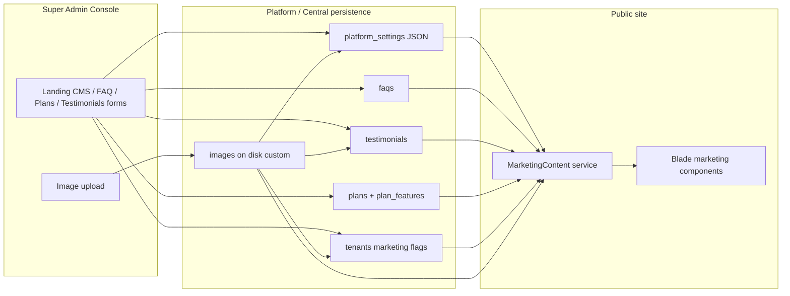

# Veyra ERP — Super Admin Landing CMS & Control Analysis

> Part of the Veyra ERP documentation set. Complements `MARKETING_CMS.md` (public read model), `MODULES.md` §6 (Platform Console), `DATABASE_ROADMAP.md`, and `ARCHITECTURE.md` (tenancy).
>
> **Status:** Binding design analysis for Super Admin → marketing/platform data. **As-built Landing CMS CRUD** is logged in `docs/LANDING_CMS_IMPLEMENTATION.md` (prefer that file for current table/view/route truth when it diverges from proposals below).
>
> **Goal:** Map how Super Admin enters/edits data → persistence (tables / JSON settings / images) → `MarketingContent` → public Blade pages.

---

## 1. Multi-Tenancy Context (important correction)

### 1.1 Veyra does **not** use `stancl/tenancy`

This repository implements **single-database, shared-schema, row-level multi-tenancy** via:

- `tenant_id` on tenant-scoped models
- `TenantContext` + `TenantScope` / `BelongsToTenant`
- Super Admin users with `users.tenant_id = null`

There is **no** `stancl/tenancy` package in `composer.json`, no landlord/tenant DB split, and no Stancl “central” connection.

### 1.2 Equivalent of Stancl’s “Central App”

For marketing CMS purposes, treat the following as the **central / platform layer** (Stancl analogy only):

| Stancl idea | Veyra equivalent |
|---|---|
| Central database / central app | Platform-global tables with **no `tenant_id`** (or nullable attribution only) |
| Tenant app data | Rows filtered by `TenantContext` / `TenantScope` |
| Central admin | Super Admin console (`/admin/*`), `tenant_id = null` operators |

**Rule (binding):** All of the following belong **strictly to the platform (central) layer** and must never be resolved through `TenantContext` / `TenantScope`:

- `platform_settings`
- `faqs`
- `testimonials` (public listing; optional `tenant_id` is attribution only)
- `plans` / `plan_features`
- Marketing CMS JSON groups (`marketing.*`)
- Platform branding uploads and marketing images (see §2)
- Legal document bodies stored in settings

Tenant-scoped data (employees, payroll, etc.) remains isolated as today. The Trusted By ticker may **read** opted-in public fields from `tenants` (`show_on_marketing`) plus polymorphic marketing logos via `HasImages` (`collection = logo`) as an explicit cross-tenant *public* read — not a tenant-scoped query. Path columns such as `marketing_logo_path` / `testimonials.logo_path` were removed in favor of `images`.

---

## 2. Polymorphic `images` Table & `custom` Disk

### 2.1 Why a dedicated table

Today several path-ish fields are (or will be) scattered:

- `testimonials.logo_path`
- `tenants.marketing_logo_path`
- Branding logo/favicon implied in Settings UI (not yet real columns)
- Future hero/showcase imagery in CMS JSON as raw paths

A single polymorphic `images` table gives Super Admin CRUD one upload pipeline, consistent deletion, and typed roles (`logo`, `avatar`, `hero`, `favicon`, …).

> **Relation to `DATABASE_ROADMAP.md`:** that doc plans tenant file attachments via `spatie/laravel-medialibrary` (ADR-13) for CVs, contracts, payslips. **Recommendation:** keep Medialibrary (or equivalent) for **tenant-scoped** private/signed media; use this **`images` + `custom` disk** for **platform/public marketing & branding** assets. Do not mix tenant private files onto the public marketing disk.

### 2.2 Proposed `images` schema

| Column | Type | Purpose |
|---|---|---|
| `id` | bigint PK | |
| `imageable_type` | string | Morph class (e.g. `App\Models\Testimonial`, `App\Domain\Tenancy\Models\Tenant`, `App\Models\PlatformSetting` or a dedicated `Branding` marker) |
| `imageable_id` | unsigned bigint | Morph id |
| `collection` | string | Role within the parent: `logo`, `logo_light`, `logo_dark`, `favicon`, `avatar`, `hero`, `og`, `partner` |
| `disk` | string | Always `custom` for this pipeline (stored for portability) |
| `path` | string | Relative path on the disk |
| `original_name` | string nullable | Original upload filename |
| `mime_type` | string nullable | e.g. `image/png` |
| `size` | unsigned int nullable | Bytes |
| `alt` | string nullable | Accessibility / SEO alt text |
| `sort_order` | unsigned int | Default `0` when multiple images share a collection |
| `created_at` / `updated_at` | timestamps | |

**Indexes:** `(imageable_type, imageable_id, collection)`, unique optional later for single-slot collections (`logo` per branding).

**Eloquent:** `Image` model + `MorphMany` / `MorphOne` on parents (`HasImages` trait). **No `tenant_id`** on `images` for platform marketing assets. If a future tenant-owned public logo is attached to `Tenant`, the row still lives on the central table; access control is by who may edit that tenant’s marketing opt-in fields (Super Admin).

### 2.3 Filesystem disk: `custom`

Add to `config/filesystems.php`:

```php
'custom' => [
    'driver' => 'local',
    'root' => storage_path('app/custom'),
    'url' => rtrim(env('APP_URL'), '/').'/media', // or /storage/custom via link
    'visibility' => 'public',
    'throw' => false,
],
```

**Operational notes:**

- Public URL must be web-reachable (`php artisan storage:link` variant or nginx alias to `storage/app/custom`).
- Store only relative `path` in DB; generate URLs via `Storage::disk('custom')->url($path)`.
- On replace/delete in admin: delete old file on `custom` when the `images` row is removed or path replaced.
- Validate uploads (mime, max size) in FormRequests; never trust client paths.

### 2.4 Migration of existing path columns

| Current field | Target |
|---|---|
| `testimonials.logo_path` | Prefer `images` morph (`collection = logo`); deprecate column after backfill |
| `tenants.marketing_logo_path` | Prefer `images` morph on Tenant (`collection = marketing_logo`); keep column as cache/denorm **or** drop after cutover |
| Settings branding logos | No columns today → `images` morph to a platform branding owner (settings key `branding` or singleton) |

v1 implementation may keep string columns as mirrors until admin upload UI ships, then single-write through `images`.

---

## 3. What Exists Today (inventory)

| Asset | DB / code | Admin UI | Public consumer |
|---|---|---|---|
| `platform_settings` | ✅ table + `PlatformSetting` model | `/admin/settings` **mock only** | `MarketingContent` reads `marketing.*` |
| `faqs` | ✅ | ❌ no CRUD page | `MarketingContent` / FAQ page |
| `testimonials` | ✅ | ❌ no CRUD page | Landing testimonials |
| `plans` / `plan_features` | ✅ | `/admin/plans` **mock only** | Pricing + landing |
| `tenants` marketing fields | ✅ `show_on_marketing`, `marketing_logo_path` | Partial (tenant detail mock; no real save) | Logo ticker via `MarketingContent` |
| `images` + `custom` disk | ❌ | ❌ | ❌ |
| `MarketingContent` | ✅ read service | — | Landing / pricing / FAQ / features |
| Admin write + cache bust | ❌ | — | — |

Seeders already populate plans, FAQs, testimonials, and marketing JSON from config/defaults.

---

## 4. Gap Analysis — Missing for Super Admin CRUD

### 4.1 Missing tables / infrastructure

| Gap | Need |
|---|---|
| `images` | Polymorphic uploads (§2) |
| `custom` disk | Config + public serving |
| Cache invalidation helper | Bust `marketing.metrics.*` and any page cache when CMS/plans/FAQs/testimonials change |
| Audit logging on CMS writes | NFR-05 — log who changed which setting/plan/FAQ |

### 4.2 Missing fields / model polish

| Entity | Gap |
|---|---|
| `platform_settings` | Optional `updated_by`; encrypted cast path for SMTP/payment keys when ops tabs go live (ADR-16) |
| `faqs` | Optional `updated_by`; category may need a controlled list (enum/config) for admin filters |
| `testimonials` | Wire uploads via `images`; optional soft deletes |
| `plans` | Admin mock still uses different shape than DB (`price` vs `price_monthly`); align UI to model. Add module toggles / numeric limits as `plan_features.feature_key` + `value` for Phase 4 enforcement |
| `tenants` | Admin UI to toggle `show_on_marketing` + upload marketing logo (via `images`) |
| Legal | Keys `legal.privacy` / `legal.terms` may not be seeded yet — Settings Legal tab should persist them |

### 4.3 Missing admin pages / routes (CRUD)

| Page | Route (proposed) | Permission | Backs |
|---|---|---|---|
| Landing CMS (exists as tab) | `GET/PUT /admin/settings` (landing tab) | `manage_settings` | `marketing.*` JSON |
| Branding / SMTP / Payments / Registration / Legal | same Settings tabs | `manage_settings` | settings keys + secrets |
| FAQ index + form | `/admin/faqs`, `/admin/faqs/{faq}` | extend catalog or under `manage_settings` | `faqs` |
| Testimonials index + form | `/admin/testimonials` | same | `testimonials` + images |
| Plans editor (exists mock) | `/admin/plans` real CRUD | `manage_plans` / `view_plans` | `plans`, `plan_features` |
| Tenant marketing opt-in | on `/admin/tenants/{tenant}` | `manage_tenants` | tenant flags + image |

**Permission catalog note (BR-807):** today Support Admin has `manage_settings` / `manage_plans` but **no** explicit `manage_faqs` / `manage_testimonials`. Options: (a) fold FAQ/testimonials under `manage_settings`, or (b) add two permissions to the catalog and docs before coding.

### 4.4 Missing write-side application pieces

- FormRequests for each CMS resource
- Controllers/actions that persist and call `MarketingContent` cache clear
- Align admin Plan drawer fields with `Plan` / `PlanFeature` columns
- Replace SettingsController mock arrays with `PlatformSetting::getValue` / `putValue`
- Image upload action using disk `custom`

---

## 5. End-to-End Flow (Admin → DB → Blade)



### 5.1 Step-by-step

1. **Super Admin** opens `/admin/settings` (Landing tab) or a dedicated FAQ/Plan/Testimonial screen.
2. **Edits** copy, toggles, plan prices, FAQ rows, or uploads an image (stored on disk `custom`, row in `images`).
3. **Save** validates (FormRequest), writes:
   - JSON groups → `platform_settings.key` / `value`
   - Rows → `faqs` / `testimonials` / `plans` / `plan_features`
   - Opt-in → `tenants.show_on_marketing` (+ image morph)
4. **Side effects:** audit log entry; invalidate marketing caches.
5. **Public request** hits `HomeController` / Pricing / FAQ → `MarketingContent` loads DB (with fallbacks only if empty) → passes props into `<x-marketing.*>` Blade components.
6. **Visitor** sees updated landing/pricing/FAQ without redeploying code.

### 5.2 JSON vs table decision (reminder)

| Content type | Store in | Why |
|---|---|---|
| Hero, CTA, footer, partners fallback, section headings | `platform_settings` JSON | Few records, edited as a form blob |
| FAQs, testimonials, plans | Dedicated tables | Ordered lists, publish flags, CRUD |
| Uploaded binaries | `images` + `custom` disk | Polymorphic, deletable, not base64-in-JSON |
| Live metrics | Not stored | Cached counts in `MarketingContent` |

---

## 6. Recommended Admin Information Architecture

Under existing sidebar groups:

**Platform**

- إعدادات المنصّة (`/admin/settings`) — tabs: Landing CMS, Branding (+ uploads), SMTP, Payments, Registration, Legal
- الخطط وحدود الميزات (`/admin/plans`) — real Eloquent CRUD

**Content (new nav group or under Platform)**

- الأسئلة الشائعة (`/admin/faqs`)
- قصص النجاح (`/admin/testimonials`)

**Tenants**

- On tenant detail: “إظهار في الموقع” + marketing logo upload

---

## 7. Suggested Implementation Order

1. Document approval (this file + permission decision for FAQ/testimonials).
2. Configure `custom` disk + `images` migration/model/`HasImages`.
3. Persist Settings Landing/Branding/Legal tabs to `platform_settings` (replace mocks); cache bust.
4. Wire `/admin/plans` to `Plan` / `PlanFeature`.
5. Build FAQ + Testimonial CRUD admin pages.
6. Tenant marketing opt-in + logo via `images`.
7. Deprecate string `*_path` columns after backfill.
8. Pest: admin authz, CRUD, public page reflects DB after save, upload on `custom` disk.

---

## 8. Security & Compliance Checklist

- [ ] Platform CMS tables never use `BelongsToTenant` global scope.
- [ ] Only Super Admin / permitted Support Admin roles write CMS (BR-801, BR-807).
- [ ] Secrets (SMTP, payment) remain encrypted; never written into `marketing.*` JSON (ADR-16).
- [ ] `custom` disk serves only intentional public marketing assets — not tenant private files.
- [ ] Image URLs are generated server-side; no user-controlled full paths.
- [ ] CMS mutations audit-logged (NFR-05).
- [ ] Testimonials unpublished by default until explicitly published (honesty rule).

---

## 9. Relationship to Other Docs

| Doc | Role |
|---|---|
| `MARKETING_CMS.md` | Public read schema + `MarketingContent` contract |
| `MARKETING.md` | Public sitemap and section order |
| `MODULES.md` §6 | Admin console pages, BR-801–808 |
| `DATABASE_ROADMAP.md` | Foundation entities; update when `images` is added |
| `ARCHITECTURE.md` | Tenancy: `TenantContext` ≠ Stancl |

**Do not introduce `stancl/tenancy` unless the constitution (`ARCHITECTURE.md` ADR-02) is formally amended.** Central vs tenant separation is already achieved by platform-global tables and Super Admin `tenant_id = null`.
