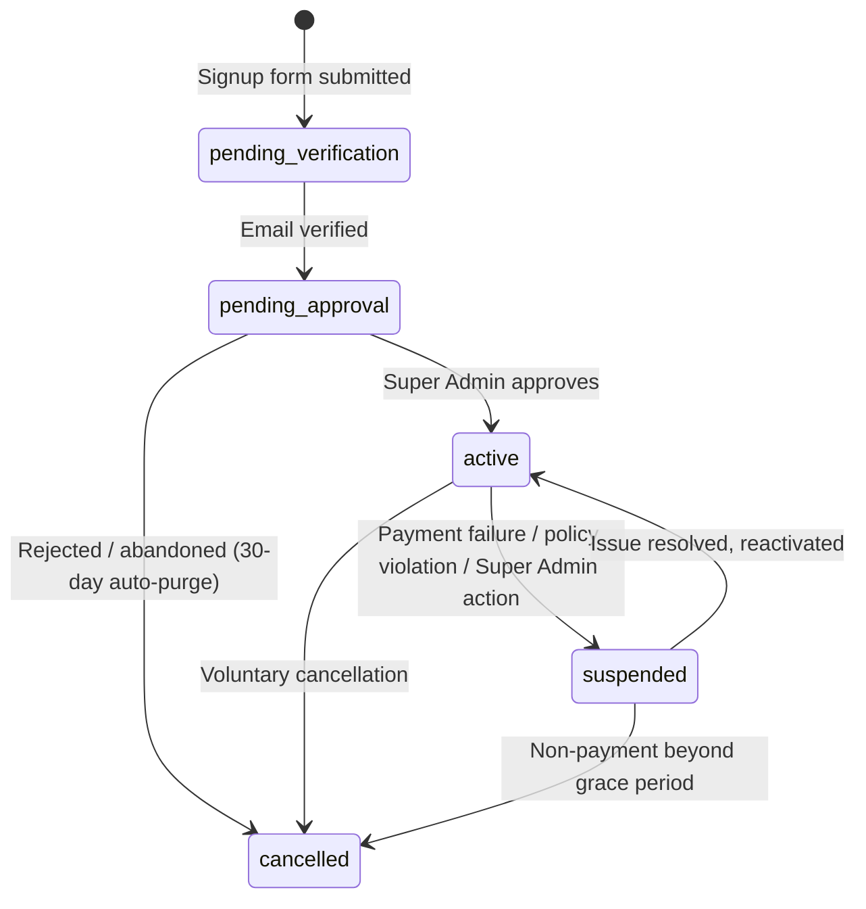

# Veyra ERP — Architecture

> Part of the Veyra ERP documentation set. See `VEYRA_DOCS.md` for the full Software Design Document. Read alongside `MODULES.md` (business rules) and `DATABASE_ROADMAP.md` (schema conventions).

## 1. Multi-Tenancy Model

### 1.1 Decision

Veyra uses **single database, shared schema, row-level multi-tenancy** via a `tenant_id` column present on every tenant-scoped table (ADR-02). This is the correct default for a lean, cost-efficient SaaS at this stage — it is *not* a shortcut; it is a deliberate architecture that must be implemented with strict discipline, because the cost of a mistake (cross-tenant data leak) is severe.

### 1.2 Enforcement Points (all four are mandatory, not optional)

1. **Data layer:** every tenant-scoped Eloquent model uses a **Global Scope** that automatically filters every query by the resolved `tenant_id`. No query bypasses this scope except explicit, audited Super Admin cross-tenant operations.
2. **Request layer:** a single `TenantContext` service is bound once per request. It resolves `tenant_id`:
   - For authenticated tenant users: from the logged-in user's own `tenant_id`.
   - For public routes (`/companies/{slug}/careers`): from the `slug` route parameter, read-only, never bound to a session.
   - For Super Admin: `tenant_id = null`; cross-tenant queries are explicit and never use the default scope.
   - **No controller, Livewire component, or service may read `tenant_id` off `Auth::user()` directly.** All resolution goes through `TenantContext`.
3. **Background/queue layer:** every queued job that touches tenant-scoped data must explicitly serialize `tenant_id` into its payload at dispatch time, and re-bind `TenantContext` when the job executes on the worker. Queue workers have no "current request," so this cannot be implicit.
4. **Cache layer:** every cache key touching tenant-scoped data is prefixed `tenant:{tenant_id}:...`. No shared cache key may serve two tenants' data.

### 1.3 Route-level enforcement

Middleware `EnsureTenantActive` gates all operational routes (HR, Projects, Finance) and only allows access when the resolved tenant's status is `active`. Setup-wizard routes (`/dashboard/setup`) are reachable only while status is `pending_approval`. See §3 for the full lifecycle.

### 1.4 Future evolution (documented now, not built now)

The `TenantContext` resolver is intentionally the *only* place tenant resolution logic lives, so that if a future large-enterprise tenant requires a dedicated database, that evolution is a change to the resolver's implementation, not a rewrite of every model/controller in the app. This is a design constraint on today's code, even though dedicated-DB tenancy is out of scope for v1.

---

## 2. Roles & Permissions (Spatie Permission + Teams)

### 2.1 Decision

Spatie Permission is configured with the **Teams feature enabled, using `tenant_id` as the team foreign key** (ADR-03). This is non-negotiable: Spatie's `roles` and `permissions` tables are global by default, and without Teams scoping, two tenants both naming a custom role "Manager" will either collide on a unique constraint or, worse, silently share/bleed role definitions across tenants.

### 2.2 Rules

- **BR-101:** Roles and permissions are scoped per tenant via the Teams mechanism. A role in Tenant A is entirely independent of a same-named role in Tenant B.
- **BR-102:** On tenant creation, default role templates are seeded automatically: `Owner`, `HR Manager`, `Finance Manager`, `Project Manager`, `Employee`. The tenant's CEO is auto-assigned `Owner`.
- **BR-103:** Only the `Owner` role (or Super Admin) may create, edit, or delete roles and permission assignments within a tenant. This capability is never delegated further.
- **BR-104:** Permission checks (Spatie `can()`) establish *feature-level* access. **Object-level** access (e.g., "a Project Manager may edit only their own projects," or BR-701's "an Employee may only see their own tasks") is enforced via Laravel **Policies** layered on top — permission checks alone are never sufficient for row-level authorization.

### 2.3 Users table

A single `users` table holds all humans:
- **Super Admin:** `tenant_id = null`. Mandatory 2FA (ADR-14). Provisioned **by invitation only** (`admin_invitations`, `MODULES.md` BR-807) — no self-service signup; managed via the `/admin/admins` console with last-admin lockout safeguards (BR-808).
- **CEO / Owner:** `tenant_id` set at tenant creation.
- **Employees:** `tenant_id` set, linked to an `employee` profile and `employee_contract`.
- **Applicants are never rows in `users`.** They are unauthenticated records associated with a `job_opening`.

Session invalidation is forced on: role/permission change, tenant suspension, and password change.

---

## 3. Tenant Lifecycle State Machine

### 3.1 Decision (ADR-04)

Five states, not three: `pending_verification → pending_approval → active → suspended → cancelled`.

### 3.2 Rules

- **BR-201:** Tenant and Owner user rows are created immediately on signup form submission, but remain `pending_verification` until the Owner's email is verified (ADR-05). **No file uploads (e.g., logo) and no dashboard access are permitted before verification.**
- **BR-202:** Upon verification, status becomes `pending_approval`; the Owner is auto-logged-in and redirected to `/dashboard/setup` — a locked-sidebar wizard covering: change temporary password, upload company logo, set base currency, set working calendar.
- **BR-203:** Middleware `EnsureTenantActive` blocks every operational route (HR, Projects, Finance) while status is not `active`. Only setup-wizard and account routes are reachable in `pending_approval`.
- **BR-204:** `pending_approval` tenants unresolved after 30 days automatically transition to `cancelled` and are scheduled for data purge per the retention policy (`DATABASE_ROADMAP.md`).
- **BR-205:** On Super Admin approval, status becomes `active`, plan features are provisioned, and the full sidebar unlocks without requiring re-login.
- **BR-206:** On `suspended`, all sessions for that tenant's users are invalidated immediately; next login attempt shows a "read-only, contact support" banner.

---

## 4. Feature Gating (SaaS Plan Limits)

Each subscription Plan defines feature limits (e.g., max employees, max projects, which modules are enabled). These are enforced via a `CheckFeatureLimit` authorization check at the **point of creation** (e.g., blocked when attempting to create a 6th project on a Starter plan) — never only hidden in the UI, since a hidden-but-reachable route is not real enforcement. Full detail in `DEVELOPMENT_ROADMAP.md` Phase 4.

---

## 5. Security Architecture

| Control | Rule |
|---|---|
| Super Admin 2FA | Mandatory (ADR-14, NFR-01). |
| Rate limiting | Enforced on `/register`, `/login`, and public careers application endpoints (NFR-02). |
| File storage | `spatie/laravel-medialibrary`, tenant-isolated paths, signed/expiring URLs — never public static paths (ADR-13, NFR-03). |
| Error pages | Custom, brand-consistent 403/404/500 pages; default framework error pages never exposed (NFR-04). |
| Audit logging | Every permission/role change and every Super Admin impersonation event is written to the Activity/Audit Log (NFR-05). |
| Platform secrets encryption | SMTP credentials and payment gateway keys held in `platform_settings` are stored via encrypted casts and never rendered in plaintext after initial save (ADR-16, NFR-14, `MODULES.md` BR-802). |

## 6. Scalability & Data Integrity Controls

| Control | Rule |
|---|---|
| Indexing | Every tenant-scoped table has `tenant_id` as the leading column of its primary composite index (NFR-06). |
| Caching | Tenant-prefixed cache keys, no shared keys across tenants (NFR-07). |
| Queues | Tenant-context-safe job payloads (NFR-08, see §1.2). |
| Tenancy evolution | Resolver abstracted for a future hybrid dedicated-DB model without app rewrite (NFR-09, see §1.4). |
| Deletion | **All core business tables/models use SoftDeletes (`deleted_at`).** Hard delete is forbidden unless an explicit `forceDelete()` is intentional (e.g. media replacement). Financial/HR records remain soft-delete-only per NFR-10; see `.cursor/rules/soft-deletes.mdc`. |
| Responsive UI | **All Admin Console and public Landing UIs must be fully responsive** (desktop, tablet, mobile, and split-screen down to ~360px). Admin sidebar is off-canvas below `lg` with RTL-safe `-translate-x-full rtl:translate-x-full` (docked at `start-0`); pinned via `lg:static` above. Data tables use `overflow-x-auto w-full`. See `.cursor/rules/responsive-ui.mdc`. |
| Payroll immutability | Locked/approved payroll runs cannot be edited; corrections are adjustment entries in a subsequent run (NFR-11, see `MODULES.md` BR-603). |

## 7. Cross-Module Communication

No module reads or writes another module's tables directly. All cross-module effects are implemented via **Events + Listeners** (e.g., `ApplicantAccepted`, `LeaveApproved`, `TimesheetLogged`, `PayrollRunApproved`), keeping module boundaries real in code, not just in documentation. See `VEYRA_DOCS.md` §13 for the backend layering convention (Controllers/Livewire → Actions → Models).

---

## 8. Platform Console Data Boundary

The Super Admin / Platform Console (`MODULES.md` §6) introduces two data shapes that sit deliberately outside the tenant-scoped model described in §1, and both must be kept that way:

- **`platform_settings` has no `tenant_id` and is never resolved via `TenantContext`.** It is platform-global configuration, not a per-tenant record. Any code path that would need to read it "for the current tenant" is a design error — settings like SMTP and payment gateway keys apply to the whole platform, not one customer.
- **`support_threads` / `support_messages` do carry a `tenant_id`** (a thread always originates from one tenant's Owner), but a Super Admin reading or replying to a thread is an **explicit, audited cross-tenant operation** — the same category of access as opening a Tenant Detail page (§1.2 point 1's "explicit, audited Super Admin cross-tenant operations" carve-out). It must never be implicitly reachable through the tenant global scope; the Super Admin console queries these tables directly, bypassing `tenant_id` filtering by design, not by accident.

Both patterns keep the same discipline as §1: tenant isolation is the default, and every exception to it is explicit and logged, never silent.
