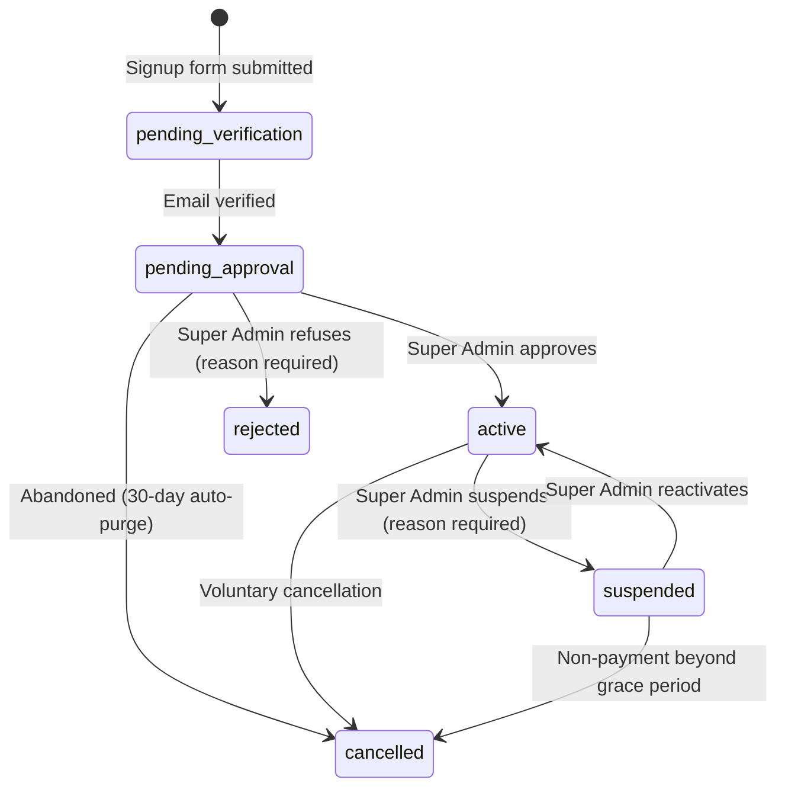

# Veyra ERP — Architecture

> Part of the Veyra ERP documentation set. See `VEYRA_DOCS.md` for the full Software Design Document. Read alongside `MODULES.md` (business rules) and `DATABASE_ROADMAP.md` (schema conventions).

## 1. Multi-Tenancy Model

### 1.1 Decision

Veyra uses **single database, shared schema, row-level multi-tenancy** via a `tenant_id` column present on every tenant-scoped table (ADR-02). This is the correct default for a lean, cost-efficient SaaS at this stage — it is *not* a shortcut; it is a deliberate architecture that must be implemented with strict discipline, because the cost of a mistake (cross-tenant data leak) is severe.

### 1.2 Enforcement Points (all four are mandatory, not optional)

1. **Data layer:** every tenant-scoped Eloquent model uses a **Global Scope** that automatically filters every query by the resolved `tenant_id`. No query bypasses this scope except explicit, audited Super Admin cross-tenant operations.
2. **Request layer:** a single `TenantContext` service is bound once per request. It resolves `tenant_id`:
   - For authenticated tenant users: from the logged-in user's own `tenant_id`.
   - For public routes (`/companies/{slug}/careers`): from the `slug` route parameter, read-only, never bound to a session.
   - For Super Admin: `tenant_id = null`; cross-tenant queries are explicit and never use the default scope.
   - **No controller, Livewire component, or service may read `tenant_id` off `Auth::user()` directly.** All resolution goes through `TenantContext`.
3. **Background/queue layer:** every queued job that touches tenant-scoped data must explicitly serialize `tenant_id` into its payload at dispatch time, and re-bind `TenantContext` when the job executes on the worker. Queue workers have no "current request," so this cannot be implicit.
4. **Cache layer:** every cache key touching tenant-scoped data is prefixed `tenant:{tenant_id}:...`. No shared cache key may serve two tenants' data.

### 1.3 Route-level enforcement

Middleware `EnsureTenantActive` gates all operational routes (HR, ATS, Finance) and only allows access when the resolved tenant's status is `active`. Setup-wizard routes (`/dashboard/setup`) sit outside it — they are registered under `tenant.context` — so they stay reachable in both `pending_verification` and `pending_approval`. See §3 for the full lifecycle.

### 1.4 Future evolution (documented now, not built now)

The `TenantContext` resolver is intentionally the *only* place tenant resolution logic lives, so that if a future large-enterprise tenant requires a dedicated database, that evolution is a change to the resolver's implementation, not a rewrite of every model/controller in the app. This is a design constraint on today's code, even though dedicated-DB tenancy is out of scope for v1.

---

## 2. Roles & Permissions (Spatie Permission + Teams)

### 2.1 Decision

Spatie Permission is configured with the **Teams feature enabled, using `tenant_id` as the team foreign key** (ADR-03). This is non-negotiable: Spatie's `roles` and `permissions` tables are global by default, and without Teams scoping, two tenants both naming a custom role "Manager" will either collide on a unique constraint or, worse, silently share/bleed role definitions across tenants.

### 2.2 Rules

- **BR-101:** Roles and permissions are scoped per tenant via the Teams mechanism. A role in Tenant A is entirely independent of a same-named role in Tenant B.
- **BR-102:** On tenant creation, default role templates are seeded automatically: `Owner`, `HR Manager`, `Finance Manager`, `Project Manager`, `Employee`. The tenant's CEO is auto-assigned `Owner`.
- **BR-103:** Only the `Owner` role (or Super Admin) may create, edit, or delete roles and permission assignments within a tenant. This capability is never delegated further.
- **BR-104:** Permission checks (Spatie `can()`) establish *feature-level* access. **Object-level** access (e.g., "a Project Manager may edit only their own projects," or BR-701's "an Employee may only see their own tasks") is enforced via Laravel **Policies** layered on top — permission checks alone are never sufficient for row-level authorization.

### 2.3 Users table

A single `users` table holds all humans:
- **Super Admin:** `tenant_id = null`. Mandatory 2FA (ADR-14). Provisioned **by invitation only** (`admin_invitations`, `MODULES.md` BR-807) — no self-service signup; managed via the `/admin/admins` console with last-admin lockout safeguards (BR-808).
- **CEO / Owner:** `tenant_id` set at tenant creation.
- **Employees:** `tenant_id` set, linked to an `employee` profile and `employee_contract`.
- **Applicants are never rows in `users`.** They are unauthenticated records associated with a `job_opening`.

Session invalidation is forced on: role/permission change, tenant suspension, and password change.

---

## 3. Tenant Lifecycle State Machine

### 3.1 Decision (ADR-04)

Six states, not three: `pending_verification → pending_approval → active → suspended → cancelled`, plus `rejected`.

> **Amended 2026-08-09.** `rejected` was added as a sixth state. The diagram
> previously routed a Super Admin refusal into `cancelled` alongside voluntary
> exits and 30-day abandonment. That conflated three different facts — *we
> turned you away*, *you left*, and *you never finished* — behind one status,
> so the lifecycle could not answer how many applications were actually
> refused, and a `rejection_reason` would have hung off records nobody
> rejected. Additive only: no existing row changes meaning.

### 3.2 Rules

- **BR-201:** Tenant and Owner user rows are created immediately on signup form submission, but remain `pending_verification` until the Owner's email is verified (ADR-05). **No file uploads (e.g., logo) and no dashboard access are permitted before verification.**
- **BR-202:** Upon verification, status becomes `pending_approval`; the Owner is auto-logged-in and redirected to `/dashboard/setup` — a locked-sidebar wizard covering: change temporary password, upload company logo, set base currency, set working calendar.
- **BR-203:** Middleware `EnsureTenantActive` blocks every operational route (HR, ATS, Finance) while status is not `active`, and returns a 403 carrying a **status-specific** Arabic explanation — a pending tenant is told it may keep completing its company profile; a suspended one is not. The isolation is **structural, not a branch in the middleware**: setup-wizard routes are registered under `tenant.context` and never under `tenant.active`, so onboarding stays reachable without an allowlist that would eventually let an operational route match it. Reachable in both `pending_verification` and `pending_approval`.
- **BR-204:** `pending_approval` tenants unresolved after 30 days automatically transition to `cancelled` and are scheduled for data purge per the retention policy (`DATABASE_ROADMAP.md`). This covers **abandonment only** — an explicit Super Admin refusal goes to `rejected` (BR-207).
- **BR-205:** On Super Admin approval, status becomes `active`, `activated_at`/`reviewed_at`/`reviewed_by` are stamped, the plan is confirmed or overridden on `tenants.plan_id`, and the full sidebar unlocks without requiring re-login. Approval is permitted **only from `pending_approval`** — approving straight out of `pending_verification` would hand a live workspace to an unconfirmed address, the exact path ADR-05 exists to close.
- **BR-207 (Rejection, added 2026-08-09):** A Super Admin refusal sets status to `rejected` and **requires a reason**, stored on `tenants.rejection_reason` and mailed to the applicant verbatim. The tenant and its Owner row are **retained, never deleted**: the row is the record that the application happened, `EnsureTenantActive` already blocks every operational route, and a deleted account cannot be reinstated if the refusal is later overturned. `activated_at` stays null, keeping "was live at some point" a reliable query.
- **BR-208 (Plan linkage):** `tenants.plan_id` is the source of truth for a tenant's plan; the legacy `tenants.plan` slug is a denormalised read cache written **in the same statement** by registration and approval. Readers resolve FK-first so a stale slug can never win — the same two-axes divergence BR-301 produced between `contract_type` and `pay_basis`.
- **BR-206:** On `suspended`, that tenant's users lose access to every operational route immediately, and are shown a "contact support" explanation on the 403.

  > **Amended 2026-08-10, to match what is enforced.** This rule previously said sessions are *invalidated* and that the tenant becomes *read-only*. Neither describes the implementation, and the second was never the intent: enforcement is `EnsureTenantActive` refusing **every** operational route on **every** request (BR-203), so a suspended tenant has **no** module access rather than reduced access. The session row is left alone deliberately — it grants nothing while the status check fails, and destroying it would log the Owner out of the account-level pages they need in order to resolve the suspension. "Read-only" is reserved for a future billing-grace state and is not what suspension does.

- **BR-209 (Suspension & reactivation, added 2026-08-10):** Suspension is permitted **only from `active`** and **requires a reason**, stored on `tenants.suspension_reason` alongside `suspended_at`/`suspended_by` and mailed to the Owner verbatim — the same shape as BR-207, because locking out a paying customer needs the same accountability as refusing an applicant. Reactivation is permitted **only from `suspended`** and clears all three columns; it is deliberately not a general "make active" switch, since routing `cancelled` or `rejected` through it would bypass the billing and review decisions those states record. `activated_at` is **never touched** by either transition: it answers "was this account ever live", which stays true throughout a suspension. Because suspension is repeatable while approval happens once, these columns describe only the **current** suspension — the durable history of every transition is the append-only platform audit log, not the tenant row.

---

## 4. Feature Gating (SaaS Plan Limits)

Each subscription Plan defines feature limits (e.g., max employees, max projects, which modules are enabled). These are enforced via a `CheckFeatureLimit` authorization check at the **point of creation** (e.g., blocked when attempting to create a 6th project on a Starter plan) — never only hidden in the UI, since a hidden-but-reachable route is not real enforcement. Full detail in `DEVELOPMENT_ROADMAP.md` Phase 4.

---

## 5. Security Architecture

| Control | Rule |
|---|---|
| Super Admin 2FA | Mandatory (ADR-14, NFR-01). |
| Rate limiting | Enforced on `/register`, `/login`, and public careers application endpoints (NFR-02). |
| File storage | `spatie/laravel-medialibrary`, tenant-isolated paths, signed/expiring URLs — never public static paths (ADR-13, NFR-03). |
| Error pages | Custom, brand-consistent 403/404/500 pages; default framework error pages never exposed (NFR-04). |
| Audit logging | Every permission/role change and every Super Admin impersonation event is written to the Activity/Audit Log (NFR-05). |
| Platform secrets encryption | SMTP credentials and payment gateway keys held in `platform_settings` are stored via encrypted casts and never rendered in plaintext after initial save (ADR-16, NFR-14, `MODULES.md` BR-802). |

## 6. Scalability & Data Integrity Controls

| Control | Rule |
|---|---|
| Indexing | Every tenant-scoped table has `tenant_id` as the leading column of its primary composite index (NFR-06). |
| Caching | Tenant-prefixed cache keys, no shared keys across tenants (NFR-07). |
| Queues | Tenant-context-safe job payloads (NFR-08, see §1.2). |
| Tenancy evolution | Resolver abstracted for a future hybrid dedicated-DB model without app rewrite (NFR-09, see §1.4). |
| Deletion | **All core business tables/models use SoftDeletes (`deleted_at`).** Hard delete is forbidden unless an explicit `forceDelete()` is intentional (e.g. media replacement). Financial/HR records remain soft-delete-only per NFR-10; see `.cursor/rules/soft-deletes.mdc`. |
| Responsive UI | **All Admin Console and public Landing UIs must be fully responsive** (desktop, tablet, mobile, and split-screen down to ~360px). Admin sidebar is off-canvas below `lg` with RTL-safe `-translate-x-full rtl:translate-x-full` (docked at `start-0`); pinned via `lg:static` above. Data tables use `overflow-x-auto w-full`. See `.cursor/rules/responsive-ui.mdc`. |
| Payroll immutability | Locked/approved payroll runs cannot be edited; corrections are adjustment entries in a subsequent run (NFR-11, see `MODULES.md` BR-603). Enforced by **model observers**, not route visibility — see §9.2. |
| Monetary precision | All money is `bigInteger` minor units with a frozen currency; no float/decimal money columns anywhere (ADR-20, `MODULES.md` BR-609). |
| Derived projections | `work_ledger_entries` is rebuildable and hard-deleted on rebuild — the single documented exception to the soft-delete rule, permitted only because it is fully reconstructible from its sources (ADR-21). |

## 7. Cross-Module Communication

No module reads or writes another module's tables directly. All cross-module effects are implemented via **Events + Listeners** (e.g., `ApplicantAccepted`, `LeaveApproved`, `TimesheetLogged`, `PayrollRunApproved`), keeping module boundaries real in code, not just in documentation. See `VEYRA_DOCS.md` §13 for the backend layering convention (Controllers/Livewire → Actions → Models).

**Phase 2A event surface.** The Approval Engine is deliberately module-agnostic: it emits a generic decision event and each subject's own listener applies the domain effect (`MODULES.md` BR-906). Finance therefore introduces:

| Event | Emitted by | Listener effect |
|---|---|---|
| `ApprovalRequested` | Approval Engine | Notify approvers via `TenantNotifier::toPermission(...)` |
| `ApprovalDecided` | Approval Engine | Subject-specific listener applies the state change |
| `PayrollRunApproved` | `PayrollRun` (on lock) | Freeze snapshots (BR-608), notify employees their payslip is ready |
| `PayrollRunPaid` | `PayrollRun` | Notify employees; feed the dashboard |
| `WorkLedgerRebuilt` | `WorkLedgerReconciler` | Invalidate tenant-prefixed HR dashboard cache keys |
| `EmployeeOffboarded` | Offboarding settlement (on approval) | Revoke access, unassign assets, close open tasks (BR-606) |

Leave's existing approve/reject path is rewired onto `ApprovalDecided` when the bespoke columns are migrated (BR-901). Its current listener behaviour — including the `LeaveRequestDecided` notification that only fires on a terminal decision — must be preserved exactly through that move; escalation to a further level stays silent.

---

## 8. Platform Console Data Boundary

The Super Admin / Platform Console (`MODULES.md` §6) introduces two data shapes that sit deliberately outside the tenant-scoped model described in §1, and both must be kept that way:

- **`platform_settings` has no `tenant_id` and is never resolved via `TenantContext`.** It is platform-global configuration, not a per-tenant record. Any code path that would need to read it "for the current tenant" is a design error — settings like SMTP and payment gateway keys apply to the whole platform, not one customer.
- **`support_threads` / `support_messages` do carry a `tenant_id`** (a thread always originates from one tenant's Owner), but a Super Admin reading or replying to a thread is an **explicit, audited cross-tenant operation** — the same category of access as opening a Tenant Detail page (§1.2 point 1's "explicit, audited Super Admin cross-tenant operations" carve-out). It must never be implicitly reachable through the tenant global scope; the Super Admin console queries these tables directly, bypassing `tenant_id` filtering by design, not by accident.

Both patterns keep the same discipline as §1: tenant isolation is the default, and every exception to it is explicit and logged, never silent.

---

## 9. Financial Architecture (Phase 2A)

Finance introduces a class of record the rest of the app does not have: one that must be **provably unchanged** years after it was written. The four controls below exist for that reason and are not optional.

### 9.1 Monetary representation (ADR-20)

Money is an integer count of minor units — halalas, cents, fils — in an `unsignedBigInteger` (rates) or signed `bigInteger` (amounts that may go negative). A `Money` value object owns all arithmetic; no controller, Blade view, or query performs money math inline. Rounding happens **once**, at the payslip total, using one documented policy.

The currency travels with the amount and is **frozen on the record**. Reading `org_settings.currency` at payroll time would let a tenant's currency change silently reinterpret every historical payslip — so contracts freeze `pay_currency` at creation (BR-301b) and runs freeze theirs at open.

### 9.2 Immutability (NFR-11, BR-610)

Enforced in three layers, in this order of authority:

1. **Model observers** — `PayrollRunObserver`, `PayslipObserver`, `PayslipLineItemObserver` throw on `updating` / `deleting` / `restoring` when the owning run is `approved` or `paid`. This is the real boundary.
2. **Routes/Policies** — no edit route resolves in those states. This is UX, not enforcement.
3. **Tests** — an explicit test asserts a direct `->save()` on a locked payslip throws.

**The known trap:** `Builder::update()` fires no model events, so a mass update bypasses layer 1 entirely. Every write path to these tables must therefore go through model instances. This is the same class of bug the evaluation approve/publish transition already hit — mass update overwrote status before events could observe it — and it is why `payroll_run_adjustments` exists as the only correction path.

### 9.3 Snapshotting (BR-608)

A locked payslip renders from its own columns alone — no join to `employees`, `employee_contracts`, or `work_ledger_entries`. Immutability of the payslip row is worthless if the values it *displays* are joined in live; editing a contract in September would otherwise change what August's "immutable" payslip shows. Snapshot at the moment of lock, then never look outward again.

### 9.4 Separation of duties (ADR-09, BR-615)

Maker ≠ checker is a **domain invariant, not a permission**. The Owner `Gate::before` bypass grants Owners every permission implicitly, so `finance.payroll.prepare` and `finance.payroll.approve` cannot be used to keep two Owners apart. The approve path asserts `approver_id !== maker_id` at the model layer, and the test covering it must be verified to fail when the assertion is removed — a test that cannot fail proves nothing.

### 9.5 Cache and tenancy discipline

Work Ledger and dashboard aggregates are cached under `tenant:{tenant_id}:...` keys (NFR-07) and invalidated on `WorkLedgerRebuilt`. Payroll generation runs as a queued job and therefore serializes `tenant_id` and re-binds `TenantContext` on execution (§1.2 point 3) — a payroll job that resolves the wrong tenant would be the most damaging possible instance of a cross-tenant leak.

---

## Implementation log

### Phase 0 — Tenant onboarding setup wizard & RBAC foundation — 2026-07-30

| Area | Notes |
|---|---|
| Routes | Dedicated `routes/tenant.php` registered from `bootstrap/app.php` under `web` + `auth` + `verified`. Setup: `GET/PUT /dashboard/setup`. Ops: `/app/*` with `tenant.active` + `permission:tenant.dashboard.view`. |
| Controllers | `App\Http\Controllers\Tenant\SetupWizardController` |
| Views | `resources/views/tenant/setup/index.blade.php` (4-step Alpine wizard); guest layout SweetAlert2 flasher toasts |
| Models | `OrgSetting`, `WorkCalendar` under `App\Domain\Tenancy\Models` — `BelongsToTenant` + `SoftDeletes` |
| Migrations | `org_settings` (unique `tenant_id`), `work_calendars` (`working_days` / `holidays` JSON) |
| RBAC | `TenantPermissionCatalog` + `SeedDefaultTenantRoles` sync; Owner-only `tenant.roles.manage` / invite (BR-103); sidebar `@can` / `permission_any` gating |
| Middleware | `tenant.context` → `BindTenantContext` (setup); `tenant.active` → `EnsureTenantActive` (ops) |
| Tests | `tests/Feature/Tenant/SetupWizardTest.php`; Pest helper `actingAsTenantUser()` |

### Phase 1a/1b — Company settings & departments — 2026-07-30

| Area | Notes |
|---|---|
| Settings | `/app/settings/company` — edit/update `OrgSetting` + default `WorkCalendar` |
| Departments | Full CRUD at `/app/departments` — soft delete; block delete when children exist |
| RBAC | HR Manager limited to departments `view_any` + `update`; Owner retains create/delete |
| Layout | `components.layouts.app` now includes Flasher toasts + Swal confirm for deletes |

### Phase 2 — Tenant roles & team invitations — 2026-07-30

| Area | Notes |
|---|---|
| Roles | `/app/settings/roles` — `RoleController`; protect seeded role names; Owner-only `tenant.roles.manage` (BR-103) |
| Team | `/app/settings/team` — members + pending invites; `TenantInvitation` (`BelongsToTenant`); mail via `TenantInvitationMail` |
| Users | `users.is_active` for deactivate/activate; cannot deactivate self or sole active Owner |
| Views | `tenant/roles/{index,create,edit,_form}`; `tenant/team/{index,create,_form}`; permission matrix reuses `x-admin.permission-domain-cards` |
| Sidebar | الأدوار والصلاحيات، أعضاء الفريق under الإعدادات |
| Tests | `tests/Feature/Tenant/RoleAndTeamTest.php` |

### Tenant permission catalog sync — 2026-08-01

| Area | Notes |
|---|---|
| Method | `TenantPermissionCatalog::syncCatalog()` — `Permission::findOrCreate` for every catalog name on guard `web`, then forget Spatie cache |
| Seed | `SeedDefaultTenantRoles` calls `syncCatalog()` before role `syncPermissions` |
| Role UI | `RoleController` calls `syncCatalog()` before store/update `syncPermissions` (intersect with catalog) |
| Users perm | `tenant.users.manage` is the sole team-access permission in the catalog |

### Gate::before Owner + Super Admin bypass — 2026-08-01

| Area | Notes |
|---|---|
| Location | `AppServiceProvider::boot()` — `Gate::before` |
| Super Admin | `User::isPlatformSuperAdmin()` → return `true` (platform team sentinel) |
| Tenant Owner | `User::isTenantOwner()` / `isOwner()` → `hasRole(Owner)` with Spatie team = `user.tenant_id` → return `true` |
| Others | return `null` so Spatie/`permission:` middleware evaluate normally |
| Role name | Catalog constant `Owner` (Arabic label: المالك) — not `"Tenant Owner"` |

### Owner implicit full access (no pivot sync) — 2026-08-02

| Area | Notes |
|---|---|
| Source of truth | `Gate::before` in `AppServiceProvider` — `isPlatformSuperAdmin()` **or** `isOwner()` / `isTenantOwner()` → `true` |
| Do not override | Never override `User::hasPermissionTo()` / `checkPermissionTo()` (breaks Spatie middleware / can 403 `/app/dashboard`) |
| Future perms | `$owner->can('future.module.*')` is `true` via Gate without pivot sync |
| Role UI | Owner edit shows full catalog notice; updates re-sync `TenantPermissionCatalog::all()` for display only |
| Tests | `RoleAndTeamTest` — empty Owner pivots still access `dashboard` + other `/app/*` routes |

### Tenant sidebar access group + team permission preview — 2026-08-01

| Area | Notes |
|---|---|
| Sidebar | Collapsible «إدارة الوصول والصلاحيات» with children `team.*` + `roles.*` (admin-sidebar children pattern); active when either nested route matches |
| Team form | Collapsible «صلاحيات مباشرة» with Alpine `selectedPermissions` + peer toggle switches (admin admins form pattern); role `@change` applies `rolePermissionsMap` defaults; manual toggle overrides before save |
| Controller | `syncMemberAccess()` → `syncRoles` + `syncPermissions` (catalog-intersected); edit loads `getDirectPermissions()` |

### Team Access CRUD (direct members) — 2026-08-01

| Area | Notes |
|---|---|
| Permission | `tenant.users.manage` replaces invite/update for team routes (Owner via catalog `all()`) |
| CRUD | `TeamController` — index/create/store/edit/update/destroy/toggleStatus; SoftDeletes on destroy |
| Users | `users.department_id` FK nullable; assign Spatie role + department on create/update |
| Password | Manual or auto-generate (`Str::password`); welcome credentials via `EmployeeWelcomeMail` |
| Guards | No self-deactivate/delete; no deactivate/delete/demote sole active Owner |
| Views | `tenant/team/{index,create,edit,_form}` — search + department filter; SweetAlert confirms |
| Invitations | Invite UI removed from team module; `TenantInvitation` model retained for a future accept flow |
| Tests | `tests/Feature/Tenant/RoleAndTeamTest.php` |

### Tenant Public Portal UI (frontend-only) — 2026-08-01

| Area | Notes |
|---|---|
| Routes | `settings.portal` (auth); public `portal.*` at `/companies/{slug}`, `/careers`, `/careers/{job}`, `/contact` (+ `POST …/contact`) in `routes/tenant.php` |
| Bootstrap | `routes/tenant.php` loaded with `web` only; auth/verified applied inside the file so the portal stays public |
| Controller | `Tenant\PublicPortalController` — portal CMS + careers apply + contact ingest into `TenantContactInbox` |
| Views | `tenant/settings/portal.blade.php`; `tenant/portal/{layout,index,careers,job-detail,contact}.blade.php` |
| UI | Arabic RTL shell; dark/light via `veyra-theme`; ambient grid/glass cards; homepage sections + dedicated contact page |
| Sidebar | «الموقع العام» under الإعدادات (`tenant.settings.view`); «رسائل التواصل» for inbox |
| Tests | `tests/Feature/Tenant/PublicPortalUiTest.php`, `ContactChatTest.php` |

### Tenant Public Portal CMS (dynamic settings) — 2026-08-01

| Area | Notes |
|---|---|
| Model | `TenantPortalSetting` (`tenant_portal_settings`) — `BelongsToTenant` + SoftDeletes; unique `tenant_id`; typed columns + JSON repeaters (`values_json`, `services_json`, `culture_perks_json`, `stats_json`, `faqs_json`) |
| Defaults | `TenantPortalSetting::defaultAttributes()` / `resolveForTenant()` so public pages render before first save |
| Owner UI | Tabbed `/app/settings/portal` — `settings.portal` (view) + `settings.portal.update` (`tenant.settings.update`); Flasher `flash()->info` on save; Alpine repeaters for services/FAQs/perks/values/stats |
| Public resolve | Active tenant by `{slug}` → `TenantContext::setTenant()` → load settings; `is_portal_enabled=false` → 404 maintenance view `tenant.portal.disabled` |
| Sections | `@if($portalSettings->isSectionActive(...))` for hero/about/services/culture/stats/careers/faq/cta/contact |
| Jobs | Published `JobPosting` records power careers listings (was demo payloads) |
| Form request | `UpdateTenantPortalSettingRequest` |
| Tests | `tests/Feature/Tenant/PublicPortalTest.php`, `PublicPortalUiTest.php` |

### HR Module Steps 1–2 — Departments & Employee Profiles — 2026-08-01

| Area | Notes |
|---|---|
| Routes | `/app/hr/departments` (`hr.departments.*`), `/app/hr/employees` (`hr.employees.*`) in `routes/tenant.php` |
| Models | `Employee` + `EmployeeStatus` enum under `App\Domain\Tenancy`; `Department::employees()` / `head()` via `department_head_id` (payroll/salary fields deferred) |
| Controllers | `Tenant\DepartmentController` (withCount employees); `Tenant\EmployeeController` — avatar/CV on `custom` disk; optional linked `User` + `EmployeeWelcomeMail` |
| Views | `tenant/hr/departments/*`, `tenant/hr/employees/*`; index `#` column uses `$loop->iteration` |
| Sidebar | Collapsible «الموارد البشرية» → الأقسام + الموظفين |
| RBAC | `hr.employees.view_any\|view\|create\|update\|delete`; HR Manager gets view/create/update (no delete) |
| Tests | `tests/Feature/Tenant/HrModuleTest.php`; `DepartmentTest` updated to `hr.departments.*` |

### HR Module Steps 3–4 — Contracts & Recruitment/ATS — 2026-08-01

| Area | Notes |
|---|---|
| Routes | `/app/hr/contracts` (`hr.contracts.*`), `/app/hr/jobs` (`hr.jobs.*` + `jobs.status`), `/app/hr/applications` (`hr.applications.*` + `applications.convert`) |
| Models | `EmployeeContract`, `JobPosting` (+ `slug`), `JobApplication` (+ `converted_employee_id`); enums for contract/job/application statuses |
| Controllers | `Tenant\HR\{Contract,JobPosting,JobApplication}Controller`; contracts highlight `end_date` within 30 days |
| Public careers | `/companies/{slug}/careers` + `/{job}` + `POST …/apply` — published jobs only; CV on `custom` disk |
| Convert | Accepted application → one-click `Employee` prefilled (name/phone/CV/job title/department) |
| Views | `tenant/hr/{contracts,jobs,applications}/*`; index `#` = `$loop->iteration` |
| Sidebar | HR group adds العقود، الوظائف والتوظيف، طلبات التقديم |
| RBAC | `hr.contracts.*`, `hr.jobs.*`, `hr.applications.*` (+ `convert`); HR Manager: no deletes |
| Tests | `tests/Feature/Tenant/HrContractsAndRecruitmentTest.php` |

### HR Module — Employee Show Tabs & Attendance Hub — 2026-08-01

| Area | Notes |
|---|---|
| Employee show | Alpine tabs (`overview` / `contract` / `attendance`); header with quick check-in/out |
| Attendance | `attendances` table + `Attendance` model; unique `(tenant_id, employee_id, date)` |
| Hub | `/app/hr/attendance` (`hr.attendance.*`) — date filter + quick check-in/out |
| Status | Auto `late` when check-in after `09:00`; half-day when worked &lt; 4h |
| Sidebar | «⏱️ سجل الحضور والغياب» under الموارد البشرية |
| RBAC | `hr.attendance.view_any\|create\|update` |
| Tests | `tests/Feature/Tenant/AttendanceTest.php` |

### HR Module — Leave & Performance Management — 2026-08-01

| Area | Notes |
|---|---|
| Leave types / requests | `leave_types`, `leave_requests` + `LeaveType`, `LeaveRequest` under `App\Domain\Tenancy\Models` |
| Balance | Computed: `annual_days − approved days_count` for the calendar year (`LeaveType::remainingDaysFor`) |
| Approval | On approve: status → approved; if today in range and employee Active → `OnLeave` |
| Legacy performance | `review_cycles` / `performance_reviews` removed 2026-08-03 → see Hierarchical Employee Evaluations |
| Controllers | `Tenant\HR\LeaveController` |
| Routes | `hr.leaves.*` under `/app/hr` |
| Sidebar | «🌴 إدارة الإجازات», «🎯 تقييمات الأداء» under الموارد البشرية |
| RBAC | `hr.leaves.view_any\|create\|approve\|manage_types` |
| Tests | `tests/Feature/Tenant/LeaveAndPerformanceTest.php` |

### Hierarchical Employee Evaluations — 2026-08-03

| Area | Notes |
|---|---|
| Table | `employee_evaluations` — unique `(tenant_id, employee_id, period_type, period_key)`; SoftDeletes |
| Periodicity | `EvaluationPeriodType`: monthly / quarterly / semi_annually / annually; keys `2026-M08`, `2026-Q1`, `2026-H1`, `2026` |
| Org default | `org_settings.evaluation_periodicity` (company settings) |
| Status | `draft` → `submitted` → `approved` (Owner locks period via «إعتماد التقييم») |
| Views | Manager = direct reports; HR = all by department (head highlighted); Owner = org-wide + approve |
| Controller | `Tenant\HR\EmployeeEvaluationController` |
| Routes | `GET/POST /app/hr/evaluations`, `POST …/approve` (`hr.evaluations.*`) |
| Access | Gate `hr.evaluations.access` (view/manage/approve **or** has direct reports) |
| RBAC | `hr.evaluations.view_any`, `manage`, `approve` |
| Trash | Catalog type `evaluations` |
| Tests | `tests/Feature/Tenant/EmployeeEvaluationsTest.php` |

### HR Module — Employee Workspace (My Space) — 2026-08-01

| Area | Notes |
|---|---|
| Relation | `User::employee()` HasOne via `employees.user_id` |
| Controller | `Tenant\HR\MySpaceController` — index + self check-in/out, leave submit |
| Route | `/app/my-space` (`hr.my-space`); actions `hr.my-space.check-in\|check-out\|leaves.store` |
| Graceful empty | Admins without linked Employee see notice card (no 403 on index) |
| View | `tenant/hr/my-space.blade.php` — welcome banner, metric badges, Alpine tabs |
| Nav | Sidebar «مساحتي الخاصة 💼» under نظرة عامة; topbar quick link |
| RBAC | `hr.my_space.view` granted to Employee (+ Owner all; also HR/Finance/PM templates) |
| Scope | Self-service always uses `auth()->user()->employee` — no client `employee_id` |
| Tests | `tests/Feature/Tenant/MySpaceTest.php` |

### Tenant Profile, Theme Default & Public Password Reset — 2026-08-02

| Area | Notes |
|---|---|
| Theme | Tenant/Admin/Auth FOUC scripts default `dark` when `veyra-theme` unset; toggle persists `dark`/`light` |
| Topbar search | Visual search input in tenant topbar (`بحث في المنصة...`) — chrome parity with admin |
| Profile | `/app/profile` → `profile.edit` / `profile.update`; Cropper.js + `custom` disk `images` avatar |
| Controller | `Tenant\ProfileController` (mirrors admin profile pattern) |
| Password reset | Public `password.request` / `password.email` / `password.reset` / `password.update` in `routes/web.php` |
| Views | `auth/forgot-password`, `auth/reset-password` (auth-split); `tenant/profile/index` |
| Tests | `tests/Feature/Tenant/ProfileTest.php`, `tests/Feature/Auth/PasswordResetTest.php` |

### Tenant Subscription Portal — 2026-08-02

| Area | Notes |
|---|---|
| Schema | `tenants.billing_cycle\|subscription_status\|trial_ends_at\|renews_at`; `tenant_invoices` table |
| Service | `App\Services\Tenancy\SubscriptionOverview` — plan join by slug, usage meters, invoices |
| Limits | `plan_features` keys `max_employees`, `max_departments`, `max_storage_mb` (+ slug defaults) |
| Route | `/app/subscription` (`tenant.subscription.index`); invoice PDF download |
| View | `tenant/subscription/index.blade.php` — header, progress meters, invoice table (`$loop->iteration`) |
| Nav | Sidebar settings: «إدارة الاشتراك والخطط 💳» |
| RBAC | `tenant.subscription.view` (Owner via full catalog; not Employee) |
| Tests | `tests/Feature/Tenant/SubscriptionTest.php` |

### Owner Executive Dashboard, Audit Logs & Reports — 2026-08-02

| Area | Notes |
|---|---|
| Dashboard | `/app/dashboard` → `Tenant\DashboardController` + `ExecutiveDashboard` (replaces Livewire shell) |
| KPIs | Total employees, active contracts, pending leaves, monthly attendance rate % |
| Charts | Chart.js CDN — monthly attendance vs absences; department distribution doughnut; hiring/turnover pipeline |
| Quick actions | Pending leave one-click approve (`hr.leaves.approve`); expiring contracts link to renew/edit |
| Approvals | `leave_requests.requires_manager_escalation`, `approval_level`, `current_approval_level`; escalate then final approve |
| Audit | `audit_logs` + `App\Domain\Tenancy\Models\AuditLog` + `TenantAuditor`; logs employee/leave/settings/role mutations |
| Audit UI | `/app/audit-logs` — Arabic human summaries via `AuditLogPresenter`; before/after modal (no raw JSON) |
| Reports | `/app/reports` CSV/PDF for attendance, leaves, employees; Owner audit export (`tenant.reports.audit-logs`) with date/module filters |
| Presenter | `App\Services\Tenancy\AuditLogPresenter` — action/module/field Arabic labels + role labels from catalog |
| RBAC | `tenant.audit_logs.view` (Owner only); `tenant.reports.view` (Owner + HR Manager); audit export requires audit permission |
| Tests | `tests/Feature/Tenant/OwnerExecutiveDashboardTest.php`; `OverviewTest` updated for controller dashboard |

### Announcements, Official Holidays & Work Schedule — 2026-08-02

| Area | Notes |
|---|---|
| Announcements | `announcements` table + `Announcement` / `AnnouncementType`; CRUD at `/app/announcements` |
| Banner | `<x-announcements-banner />` in tenant `layouts.app` — active/pinned broadcasts on all `/app/*` pages |
| Holidays | `official_holidays` + `OfficialHoliday`; CRUD at `/app/holidays`; supports `is_recurring` (month/day) |
| Leave math | `LeaveRequest::calculateDaysCount` excludes overlapping official holidays (0 if fully covered) |
| Work schedule | `work_calendars` + `work_start_time`, `work_end_time`, `grace_period_minutes`, `weekend_days`; UI `/app/settings/work-schedule` |
| Attendance | `Attendance::resolveLateThreshold()` = start + grace (default 09:00 fallback) |
| Sidebar | Settings: جدول العمل، التعميمات والإعلانات 📢، العطلات الرسمية 📅 |
| RBAC | `tenant.announcements.*`, `tenant.holidays.*` (Owner + HR Manager manage); schedule uses `tenant.settings.*` |
| Tests | `tests/Feature/Tenant/AnnouncementsAndHolidaysTest.php` |

### Asset & Custody Management — 2026-08-02

| Area | Notes |
|---|---|
| Models | `Asset` → `tenant_assets`; `AssetAssignment` → `tenant_asset_assignments` under `App\Domain\Tenancy\Models` |
| Enums | `AssetCategory` (`laptop`, `phone`, `vehicle`, `accessory`, `document_seal`, `other`); `AssetStatus` (`available`, `assigned`, `under_maintenance`, `retired`); `AssetCondition` (`new`, `good`, `fair`) |
| Codes | Auto `AST-001` via `Asset::nextAssetCode()` when `asset_code` omitted; unique per tenant |
| Routes | `/app/assets` index/store/update; `POST …/{asset}/assign`; `POST …/{asset}/return`; `GET …/employee/{employee}` (`tenant.assets.*`) |
| UI | `resources/views/tenant/assets/` — KPI cards, filters, modals (add/assign/return/edit); employee show tab «العُهد والأصول 💼» |
| Sidebar | HR group: إدارة العُهد والأصول 💼 |
| RBAC | `hr.assets.view_any`, `hr.assets.manage` — Owner (all) + HR Manager |
| Audit | `asset.created`, `asset.updated`, `asset.assigned`, `asset.returned` (module `hr`) |
| Tests | `tests/Feature/Tenant/AssetManagementTest.php` |

### Tenant Owner Dual-Channel Notifications (Wave 1) — 2026-08-02

| Area | Notes |
|---|---|
| Table | Laravel standard `notifications` (UUID, polymorphic `notifiable`, `data`, `read_at`) — not `platform_notifications` |
| Recipients | Tenant `Owner` role only via `TenantOwnerNotifier` |
| Channels | `via() => ['database', 'broadcast']`; `ShouldBroadcastNow`; event `.TenantNotificationCreated` |
| Private channel | `tenant.{tenantId}.notifications.{userId}` authorized in `routes/channels.php` |
| Base class | `App\Notifications\Tenant\TenantOwnerNotification` |
| Wave 1 triggers | `LeaveRequestSubmitted`, `EmployeeStatusChanged`, `AssetReturned`, `JobApplicationSubmitted`, `RolePermissionsChanged` |
| API | `GET /app/notifications`, `POST …/read-all`, `POST …/{id}/read` (`tenant.notifications.*`) |
| UI | Tenant topbar bell badge + drawer + Echo toast/sound (`resources/js/echo.js`) |
| Tests | `tests/Feature/Tenant/OwnerNotificationTest.php` |

### Tenant Owner Notifications Waves 2–4 — 2026-08-02

| Area | Notes |
|---|---|
| Realtime UI | Echo callback updates unread badge + prepends drawer item + toast/sound without refresh |
| Wave 2 | `EmployeeCreated`, `AssetAssigned`, `ApplicantAccepted`, `AttendanceMarkedLate`, `UrgentAnnouncementPublished`, `TeamMemberCreated` / `TeamMemberDeactivated` |
| Wave 3 | `ContractLifecycleChanged` (created/updated/terminated), `SubscriptionLimitApproaching` (≥80%), `SubscriptionLimitReached` (block at 100%) |
| Plan guard | `PlanLimitGuard` blocks employee/department create at quota; fires limit events |
| Wave 4 | `tenant:send-expiring-contract-notifications` (daily 07:00), `tenant:send-subscription-renewal-notifications` (daily 07:15); once-per-day cache keys |
| Subscriber | `NotifyOwnersOfWaveEvents` registered in `AppServiceProvider` |
| Tests | `tests/Feature/Tenant/OwnerNotificationWavesTest.php` |

### Tenant Contact Messages (portal inbox) — 2026-08-03

| Area | Notes |
|---|---|
| Threading | One conversation per `(tenant_id, sender_email)`; repeat portal submissions append messages |
| Intake | `POST /companies/{slug}/contact` (`portal.contact.store`) → `TenantContactInbox::ingestPortalInquiry()` |
| Broadcast | `NewContactMessageReceived` on `private-tenant.{tenantId}.notifications.{userId}`; badge via `NewContactMessageNotification` |
| Receipts | pending ✓ → delivered ✓✓ (after Reverb fan-out) → read ✓✓ blue (Owner opens thread via AJAX) |
| Inbox | `/app/contact-messages` — Active/Archived folder toggle (AJAX `GET …/threads?folder=`); AJAX `show` / `reply` / `archive` / `unarchive` / `destroy`; three-dots menu (أرشفة↔إلغاء الأرشفة / حذف); archived threads are read-only until unarchived |
| Reply | `POST …/{thread}/reply` JSON — stored in thread + `ContactMessageReply` mail; blocked while archived |
| RBAC | `tenant.contact_messages.view_any`, `tenant.contact_messages.manage` — Owner + HR Manager |
| Sidebar | «رسائل التواصل» under الإعدادات |
| Seeder | `TenantRolesAndPermissionsSeeder` syncs catalog + re-applies `SeedDefaultTenantRoles` per tenant |
| Auth | Routes use `can:tenant.contact_messages.*` so Laravel Gate (Owner `Gate::before`) authorizes |
| Tests | `tests/Feature/Tenant/ContactChatTest.php` |

### Tenant Trash / Soft-delete console — 2026-08-03

| Area | Notes |
|---|---|
| SoftDeletes audit | Core tenant CRUD models already use `SoftDeletes` + `deleted_at` (Employees, Assets, Leaves, Contracts, Contact threads, Departments, Jobs, Applications, Announcements, Holidays, Team users, …). `AuditLog` remains append-only; no Document entity (files are path columns). |
| Inbox UI | `/app/trash` — `Tenant\TrashController` + `Tenancy\TrashManager` + `Tenancy\TrashableResourceCatalog` (mirrors `/admin/trash`) |
| Routes | `GET /app/trash`, `POST …/restore`, `DELETE …/force-delete`, `DELETE …/empty`, plus bulk restore/force-selected |
| Feedback | Destroy actions call `TrashManager::flashSoftDeleted` (warning toast + Undo); contact AJAX delete returns `undo_url`. Tenant app layout supports undo toast like admin. |
| Confirm | Default Swal: «هل أنت تأكد من الحذف؟» via `data-swal-confirm` |
| RBAC | `tenant.trash.view_any` / `restore` / `force_delete` — Owner all; HR Manager view+restore |
| Sidebar | «سلة المحذوفات» under نظرة عامة |
| Tests | `tests/Feature/Tenant/TrashManagementTest.php` |

### Finance Phase 2A — specification & schema foundations — 2026-08-06

**Specification only. No migrations run, no PHP files created — schema blueprints approved separately before implementation.**

| Area | Notes |
|---|---|
| Strategy | **ADR-18** — Phase 2 splits into 2A (Payroll) and 2B (Revenue). 2B blocked on the unbuilt Projects & Timesheets module; pairing them would block payroll on unrelated work |
| Pay axis | **ADR-19** — `contract_type` kept intact (employment form); new `pay_basis` (`salaried`/`hourly`/`unpaid`) is the sole pay-computation input. Resolves the BR-301 vs. `ContractType` enum contradiction by splitting the axis rather than forcing either side to match |
| Money | **ADR-20** — `bigInteger` minor units everywhere; rates unsigned, amounts signed; round once at the payslip total; currency frozen on the record |
| Work Ledger | **ADR-21** — materialized `work_ledger_entries`, one row per employee-date, idempotent rebuild, hard-delete on rebuild (documented NFR-10 exception). Locked periods refuse rebuild (BR-407) |
| Approvals | **ADR-08 extended** — `approvals` table built now, before its second consumer. Leave's three bespoke escalation columns migrate in and are dropped (BR-901). Morph-map aliases, never FQCNs (BR-902) |
| Tax | **ADR-22** — VAT reserved, not built. `DATABASE_ROADMAP.md` §5 specifies what Phase 2B's invoicing schema must carry for MENA compliance |
| New rules | BR-301a/b, BR-403–BR-407 (Work Ledger), BR-608–BR-617 (Finance), BR-901–BR-906 (Approval Engine) |
| Docs touched | `VEYRA_DOCS.md` (v1.2 → v1.3), `MODULES.md`, `DATABASE_ROADMAP.md`, `ARCHITECTURE.md` (§6, §7, new §9), `DEVELOPMENT_ROADMAP.md` |

**Outstanding documentation debt (pre-existing, not from this session):** the implementation log has no entries for the 2026-08-05 session — role-aware sidebar, Task/Scrum module, split role dashboards, the `TenantNotifier` rebuild, My Space retirement, and the DESIGN_SYSTEM §8 table standard all shipped without a log entry, contrary to `.cursor/rules/documentation-logging.mdc`. Backfilling this is tracked separately.

### Finance Phase 2A — Approval Engine, Work Ledger & contract pay fields — 2026-08-06

| Area | Notes |
|---|---|
| Migrations | `approvals`, `work_ledger_entries`, `add_pay_fields_to_employee_contracts`, `normalize_audit_log_subject_types` |
| Enums | `Tenancy\Enums\{ApprovalStatus, WorkLedgerDayType, WorkLedgerSource, PayBasis}` |
| Models | `Tenancy\Models\Approval` (SoftDeletes), `Tenancy\Models\WorkLedgerEntry` (**no** SoftDeletes — ADR-21) |
| Morph map | `ApprovableCatalog` + `Relation::morphMap()` in `AppServiceProvider` — **non-enforcing** (ADR-08) |
| Index note | `approvals` declares `approvable_type`/`approvable_id` manually rather than via `$table->morphs()`, whose implicit index leads with `approvable_type` and violates NFR-06 |
| Audit fallout | `TenantAuditor` writes `getMorphClass()`, so mapped models now record the alias. `normalize_audit_log_subject_types` backfills historical FQCN rows; it iterates `ApprovableCatalog::morphMap()` so it stays correct as subjects join the map |
| Tests | `ApprovalEngineTest` (10), `WorkLedgerTest` (10), `ContractPayFieldsTest` (8) |

### Finance Phase 2A — Payroll engine core — 2026-08-06

| Area | Notes |
|---|---|
| Migrations | `payslip_line_item_types`, `payroll_runs`, `payslips`, `payslip_line_items` |
| Namespaces | Models/Enums/Support/Exceptions under `App\Domain\Finance\*`; services under `App\Services\Finance\*` — mirrors the existing `Domain\Tenancy` + `Services\Tenancy` split rather than `VEYRA_DOCS.md` §13's single `Domain/Finance` folder |
| **BR-611 enforcement** | `payroll_runs.active_period` is a **stored generated column**: `if(deleted_at is null and status <> 'cancelled', period, null)`, unique with `tenant_id`. A plain unique on `(tenant_id, period)` would permanently burn a period once a draft is cancelled; putting `deleted_at` in the key fails outright because MySQL/MariaDB treat NULLs as distinct, so two live rows would both pass. NULL-distinctness is exactly what makes the sentinel work — many dead runs may coexist, only one live run holds a period |
| **Sign convention** | Every monetary column is signed minor units expressed as **effect on net pay**: `net = base + absence_deduction + allowances_total + deductions_total`, with the last two `<= 0`. One rule for the whole module; the display layer negates for presentation |
| Rounding | `PayslipCalculator::proportion()` does exact integer half-up via `intdiv` + remainder — **no float touches money at any point**, not even in rounding (ADR-20) |
| Hourly absence | Hourly pay carries **no** absence deduction: unworked minutes were never paid, so deducting again double-penalizes the same absence. Only `salaried` deducts |
| Proration | Falls out of the ledger — `scheduled_days / period_scheduled_days` — so a mid-period joiner needs no separate proration calendar (BR-605) |
| Line item sign | `PayrollRunBuilder::signedDefault()` derives sign from `kind`, so a deduction type misconfigured with a positive default cannot add money to a run |
| Multiple contracts | `payableContracts()` takes one active contract per employee (latest `start_date`), preventing a mid-transaction collision on the `(run, employee)` unique key |
| Guards | Invalid period, live run exists, unpriced contracts, unresolved `workday` ledger rows (BR-405), mixed pay currencies — all fail before a row is written, via `PayrollRunException` |
| Tests | `PayrollEngineTest` (23) — 11 pure-calculator, 12 builder/guard/isolation |

**Not yet built at time of writing:** `WorkLedgerReconciler`, the immutability observers, state transitions, the finance permission group — all delivered in the entry below.

### Finance Phase 2A — Reconciler, immutability observers & state actions — 2026-08-06

| Area | Notes |
|---|---|
| Reconciler | `Services\Finance\WorkLedgerReconciler` — the **writer**. Precedence `holiday > weekend > excused > present > absent` (BR-403); idempotent hard-delete-and-reinsert per period (BR-406); refuses a period frozen by a locked run (BR-407) |
| Observers | `Domain\Finance\Observers\{PayrollRun,Payslip,PayslipLineItem}Observer`, registered in `AppServiceProvider`. Block `updating` / `deleting` / `forceDeleting` on locked runs |
| One legal mutation | `approved → paid` is permitted on a locked run, and only when the dirty set is exactly `status` + `paid_at` — it records disbursement without touching a figure |
| Actions | `Domain\Finance\Actions\{SubmitPayrollRunForApproval, ApprovePayrollRun, RejectPayrollRun, MarkPayrollRunPaid, RecalculatePayrollRunTotals}` |
| **Ordering is load-bearing** | `ApprovePayrollRun` recalculates totals **while still unlocked**, then flips status last. Setting status first would make the observer reject the very snapshot the lock exists to preserve (BR-608) |
| **BR-617 tightened** | Locked runs cannot be soft-deleted either. A soft delete nulls `active_period`, freeing the month for a second run; restoring the original would then hit the unique key and fail |
| **BR-618 added** | New empty-ledger guard in `PayrollRunBuilder`. BR-405 counts `workday` sentinels, so zero rows passed it — then `period_scheduled_days = 0` sent the calculator down its full-base fallback and paid everyone in full |
| Permissions | New `finance` catalog group (7 permissions) + `hr.my_payslips.view` in the self-service bucket. **Finance Manager gets `prepare`/`pay` but deliberately NOT `approve`** (BR-615, ADR-09); `tenant:sync-role-permissions` run against all 5 tenants |
| Two bugs caught by tests | `getOriginal()` applies casts and returns the enum, not a string — needed `getRawOriginal()`. `Builder::value()` likewise applies casts; the observers now compare the enum directly rather than round-tripping through a string |
| Tests | `PayrollLifecycleTest` (22) — reconciler classification/idempotence/freeze, empty-ledger guard, full state machine, maker≠checker, observer immutability, permission separation |

### Finance Phase 2A — Payroll UI (controllers, routes, views) — 2026-08-06

| Area | Notes |
|---|---|
| Controllers | `Tenant\Finance\PayrollRunController` (index, create, store, show, edit, update, destroy, recalculate, submit, approve, reject, disburse), `Tenant\Finance\PayslipController` (show, print) |
| Namespaces | `App\Http\Controllers\Tenant\Finance\` and `resources/views/tenant/finance/` — codebase convention (`Tenant`, `views/tenant`), not the `Tenancy`/`tenancy` in the original brief |
| Form Requests | `Tenant\Finance\{StorePayrollRunRequest, UpdatePayrollRunRequest, RejectPayrollRunRequest}` |
| Routes | `/app/finance/payroll-runs/*` (`finance.payroll-runs.*`) and `/app/finance/payslips/*` (`finance.payslips.*`) — 14 routes |
| **Edit scope** | A run has no directly editable financial fields — figures derive from the Work Ledger and line items. `edit`/`update` cover `notes` plus draft line-item amounts; `recalculate` re-rolls totals. Base pay and absence deductions are never hand-editable |
| Line item input | Form submits a positive MAJOR-unit magnitude; the controller converts to minor units and takes the sign from the line's own `kind`, so the UI cannot flip an allowance into a deduction |
| **Payslip routes carry no permission middleware** | They serve two audiences at one URL — finance staff viewing anyone's payslip, an employee viewing their own. `PayslipController::authorizeView()` resolves which, per BR-614 (own payslip only, locked runs only) |
| Domain errors | Builder/transition/immutability exceptions are caught and flashed as error toasts rather than surfacing as 500s |
| Flasher | `flash()->success/info/error` on every action; `TrashManager::flashSoftDeleted()` on destroy, giving the standard undo toast |
| Soft delete | Registered as `payroll-runs` in `TrashableResourceCatalog` — soft-deleted drafts appear in the shared `/app/trash` console. **No module-specific trash view.** Locked runs can never be deleted, so they never reach the trash and can never be purged from it |
| Views | `tenant/finance/payroll-runs/{index,create,edit,_form,show}.blade.php`, `tenant/finance/payslips/{show,print}.blade.php` |
| **New shared component** | `<x-ui.money :amount :currency :signed />` wraps `<x-ui.ltr>` and converts minor units for display. Makes DESIGN_SYSTEM §8 structural for money — there is no way to render an amount through it and end up with `dir="ltr"` on a `<td>` |
| Print view | `payslips/print.blade.php` is standalone inline CSS in a fixed light theme (§2.2), same exempt category as `reports/print/*` |
| Sidebar | New «المالية والرواتب» group gated on `finance.payroll.view_any` |
| Tests | `PayrollHttpTest` (26) — index/filters/empty state, CRUD, transitions, maker-checker over HTTP, soft delete + trash restore, payslip visibility per BR-614, cross-tenant 404s |

### Finance Phase 2A — dashboard, self-service, notifications & adjustments — 2026-08-06

| Area | Notes |
|---|---|
| Dashboard | `Services\Finance\FinanceDashboard` + `Tenant\Finance\FinanceDashboardController` → `tenant.finance.dashboard`. KPIs, 6-month cost trend (gaps filled — a skipped month would make an unpaid period look like it never existed), status breakdown, pending-approval alerts, top cost centres |
| **Cost side only** | Revenue / Net Profit tiles are **absent, not zeroed** (BR-607, ADR-18), with an on-page banner explaining why. Top cost centres read `department_name` off the payslip **snapshot**, so a department rename cannot rewrite what a locked period cost (BR-608) |
| Dispatcher | `DashboardController` gains a Finance branch, ordered **Finance → HR → Employee**. A Finance Manager also holds `hr.my_dashboard.view` through the self-service bucket, so a broader check placed first would swallow them |
| Sidebar | `$financeGroup` mirrors the `$hrGroup` shape exactly: Owner gets one collapsible «قسم المالية» dropdown, Finance Manager gets the same items flat under «المالية والرواتب». Same render loop, only the config differs. `$homeRoute` resolution follows the same Finance-first ordering |
| Self-service | `Tenant\Finance\MyPayslipController` → `tenant.finance.my-payslips`, gated on `hr.my_payslips.view`. Locked runs only (BR-614); employee id is never read from the request; a user with no employee profile gets a graceful notice, not a 403 |
| Notifications | `Notifications\Tenant\Finance\{PayrollRunSubmitted, PayrollRunApproved, PayrollRunDisbursed}Notification`, dispatched from the actions via `TenantNotifier` with explicit resolvers |
| Routing choices | Submit → `toPermission('finance.payroll.approve')` **excluding the maker** (they are the one person who cannot act on it, BR-615). Approve → back to the maker. Disburse → one notification **per employee carrying their own payslip**, since the link must land on the only payslip they may read (BR-614) |
| **Adjustments (BR-603)** | `payroll_run_adjustments` + `PayrollRunAdjustment` + `RecordPayrollAdjustment`. An adjustment writes an audit row **and** a signed line item on the carrying draft's payslip — without that second step it would be recorded and never paid. Guards: target must be a draft, original must be locked, a run cannot adjust itself, no zero amounts, reason required, and the employee must exist on the carrying run or the correction has nowhere to land |
| Line item types | Full CRUD (`finance.line-item-types.*`) + `PayslipLineItemTypeSeeder`. Sign is derived from `kind` on write, so flipping allowance→deduction flips the stored sign. **Seeder ships all types inactive with zero defaults** — a seeder that silently added money to every payslip would be an expensive convenience |
| Trash | `line-item-types` registered in `TrashableResourceCatalog`. Deleting a type never rewrites history: line items already on payslips snapshot their own label and kind (BR-608) |
| Tests | `FinanceModuleTest` (29) — dispatcher ordering, both sidebar shapes, dashboard payload, self-service visibility, all three notification routings, line item type CRUD + sign coercion, and the full adjustment path with its six guards |

*(Expenses and Offboarding Settlement were deferred at this point and delivered in the entry below.)*

### Finance Phase 2A — Expenses & Offboarding Settlement — 2026-08-06

| Area | Notes |
|---|---|
| Migrations | `expense_categories`, `expenses`, `offboarding_settlements` |
| Namespaces | `App\Domain\Finance\{Models,Enums,Actions,Observers,Exceptions}` and `App\Services\Finance` — **not** the `Domain\Tenancy\Models\Finance\` / `Domain\Tenancy\Models\HR\` in the brief, which would have introduced a third models namespace alongside the existing `Domain\Finance\Models` (PayrollRun, Payslip) |
| **Expenses on the Approval Engine** | First real second consumer of `approvals` (ADR-08). `approvable_type` stores the `expense` morph alias; the expense's own `status` is a denormalised mirror so lists need no join. BR-904's one-open-approval guard runs with `lockForUpdate` inside the submitting transaction |
| Expense separation of duties | The submitter may not approve or reject their own claim — an employee approving their own reimbursement is the single most obvious abuse of an expense workflow. Asserted in the actions, not only by permission |
| Claimable vs not | `is_claimable` distinguishes "the employee paid and is owed it back" from a company cost already settled directly. A non-claimable expense still needs approval and still counts toward the dashboard, but **cannot be disbursed** — marking it paid would imply a reimbursement that never happened |
| Rejection is not terminal | A rejected claim becomes editable again and resubmits against the **same** subject, so its approval history stays in one place rather than fragmenting across new records |
| **EOSB formula ⚠️** | **`docs/` specifies no EOSB rules** — BR-606 says only "unused leave payout + prorated final pay" — and the entitlement is statutory, so it differs by jurisdiction. The common GCC/Saudi tiered pattern (½ month/year to 5 years, 1 month/year after, with a resignation taper) ships as the **default**, and remains **not legal advice**. As of ADR-23 it is **tenant-configurable**: see the row below |
| **EOSB rules are configuration** (ADR-23) | Rates, the tier boundary, the taper bands and the nominal month live in `finance_settings` per tenant and reach the calculator as an `EosbPolicy` value object — passed **in**, never looked up, which is what keeps `OffboardingCalculator` pure (no Eloquent, no clock, no tenant context). Rates are integer **basis points**, never floats: ADR-20 governs the multiplier as much as the amount, and a third of an entitlement is 33.33%. A tenant with no row computes on `EosbPolicy::default()` — byte-identical to the constants this replaced, so the refactor changed no number |
| **The rules are part of the snapshot** | `offboarding_settlements.eosb_policy` freezes the policy each settlement was computed under, and the settlement screen renders from it. Without this, editing a rate would leave every approved and paid settlement unable to explain its own figure — the locked record must stand alone (BR-608). Rows predating the column read back as the defaults, which is what they were computed under |
| Accrual is monthly, not yearly | 30 months earns its extra six months rather than flooring to two years |
| Hourly settlements | An hourly employee has no monthly wage, so EOSB and leave payout derive from a nominal working month — 8h × 22d by default, now configurable per tenant. Averaging real earnings would need a payslip history the settlement may not have, and would pay two identical contracts differently |
| **Lifecycle locking** | Disbursement terminates the **contract**, not just the employee status — `PayrollRunBuilder` selects by contract status, so terminating the contract is what actually freezes future payroll. Setting only employee status would look right in the UI and keep paying them. Also deactivates (never deletes) the linked user account |
| One live settlement per employee | Same stored-generated sentinel as `payroll_runs.active_period` (BR-611): `active_employee_id` is NULL for cancelled/deleted rows |
| Manual inputs ⚠️ | Loan and other deductions are typed in, not derived — **there is no loans table in the system**. Flagged in the form request and on the create form |
| Dashboard | Four new tiles (approved expenses, unpaid claims, EOS liability committed vs paid), a pending-decisions panel, and an expense-by-category breakdown |
| Tests | `ExpenseModuleTest` (19), `OffboardingSettlementTest` (24), `FinanceSettingsTest` (25) — workflow transitions, EOSB precision at tier boundaries and the resignation taper, immutability, lifecycle locking, HTTP endpoints, cross-tenant isolation. `FinanceSettingsTest` additionally pins the defaults to the pre-ADR-23 constants, so any drift in the "we changed no number" claim fails the suite |

**A finding worth recording:** a model whose `updating` observer throws **keeps the rejected attribute dirty in memory**. Reusing that instance presents the rejected field to the next guard, which then correctly refuses a legitimate transition. Real requests discard the instance; anything that catches a lock exception and continues on the same object must `refresh()` first.
