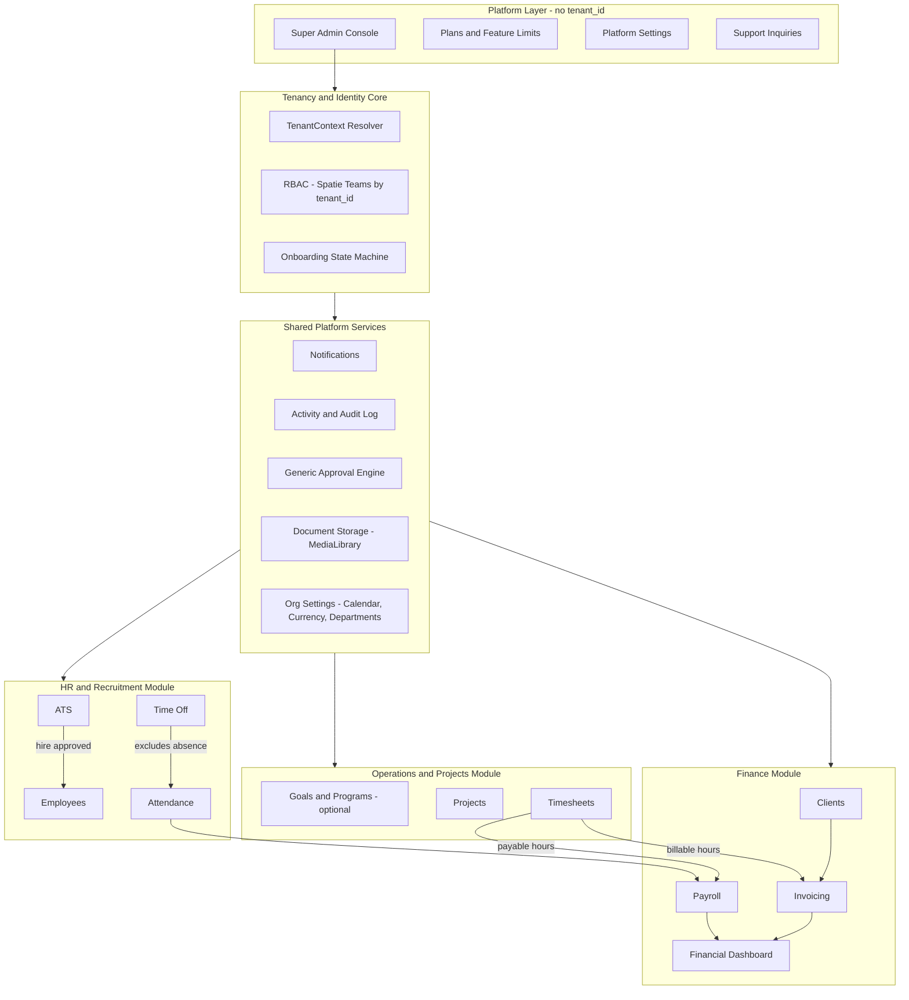
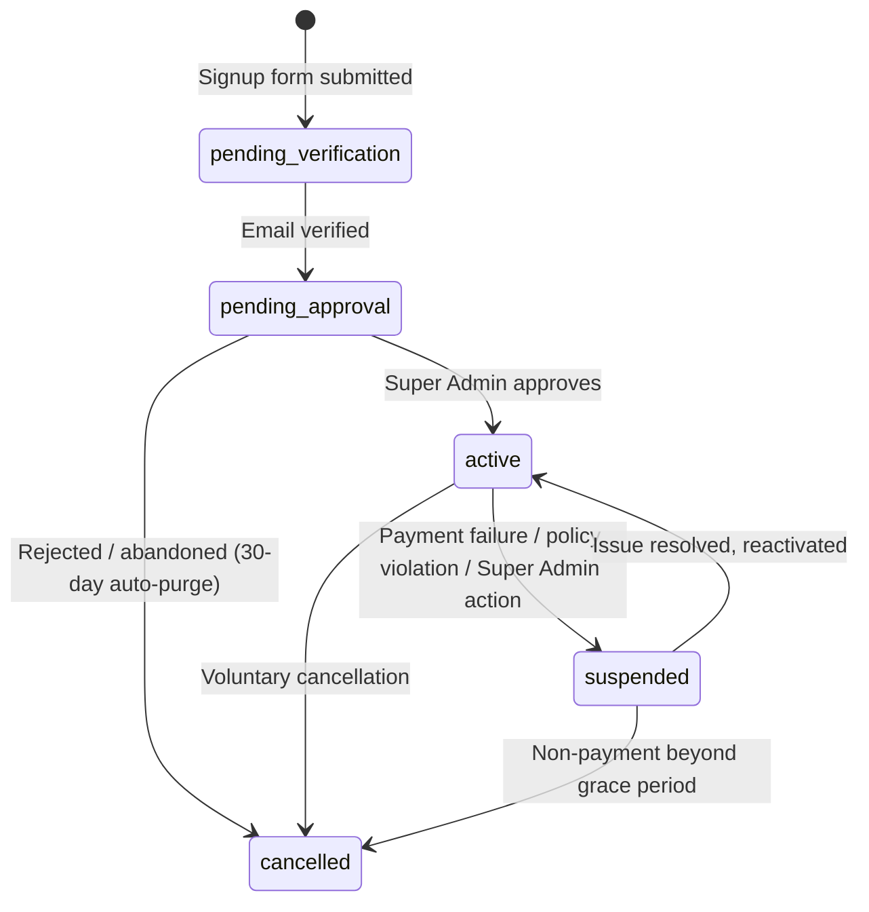

# Mada ERP — Software Design Document (SDD)

## Document Control

| Field | Value |
|---|---|
| Document | Mada ERP — Software Design Document (Master Reference) |
| Version | 1.3 (Foundation Architecture + Employee Workspace & Appearance Strategy + Super Admin Platform Console + Finance Phase 2A Foundations) |
| Status | **Binding — treat as the system's constitution** |
| Owner | Product/Engineering (CTO function) |
| Date | 2026-07-20 |
| Last amended | 2026-08-10 — Super Admin suspension and reactivation implemented, closing the Phase 1 exit criterion (BR-206 amended to match enforcement, BR-209 added, `tenants.manage` separated from `tenants.update`). Previously 2026-08-09 — tenant lifecycle gains a sixth `rejected` state with a mandatory reason, and `tenants.plan_id` becomes the plan source of truth (ADR-04 amended, BR-203/204/205 revised, BR-207/BR-208 added). EOSB rules made tenant-configurable and snapshot per settlement (ADR-23, BR-624–BR-627). Previously 2026-08-06 — Finance delivery split (ADR-18), pay basis axis (ADR-19), monetary precision (ADR-20), Work Ledger materialization (ADR-21), tax/VAT reservation (ADR-22) |
| Applies to | All engineering, design, and QA work on Mada ERP, in all future sessions |

**Precedence rule:** This document (and the rest of `docs/`) is the single source of truth. No code, migration, or UI change may contradict a rule defined here. If a new requirement isn't covered, it must be added here first — as a new numbered rule — before being implemented. Every AI session working on this repository must read all files in `docs/` before proposing or making changes.

**Companion documents (all inside `docs/`):**
- `PROJECT_VISION.md` — why Mada exists, value proposition, non-goals
- `ARCHITECTURE.md` — multi-tenancy, RBAC, tenant lifecycle
- `MODULES.md` — per-module business rules
- `USER_JOURNEYS.md` — critical end-to-end flows
- `DESIGN_SYSTEM.md` — UI/UX, theming, RTL/LTR rules
- `DATABASE_ROADMAP.md` — conceptual schema and data conventions
- `DEVELOPMENT_ROADMAP.md` — phased delivery plan
- `MARKETING.md` — public marketing site sitemap, landing flow, and build plan
- `MARKETING_CMS.md` — marketing CMS database schema, settings JSON groups, and `MarketingContent` cutover plan
- `ADMIN_CMS_ANALYSIS.md` — Super Admin Landing CMS gap analysis, polymorphic images, `custom` disk, admin→DB→Blade flow

This file is the full consolidated reference; the companion files are focused extracts of the same binding rules for quick lookup.

---

## 1. Purpose & Scope

Mada ERP is a multi-tenant, commercial SaaS platform unifying Recruitment/HR, Project Operations, and Finance/Payroll for SMB and mid-market organizations. It is built as a **real-world commercial product**, not a prototype — every architectural decision below is made with production scale, security, and maintainability as the bar, not classroom simplicity.

**Technology baseline:** Laravel 13, Blade, Livewire 3, Alpine.js, Tailwind CSS, MySQL, Spatie Permission (Teams feature enabled), single-database row-level multi-tenancy (`tenant_id`).

---

## 2. Product Vision

> Mada ERP is the operating system for growing SMB and mid-market teams — unifying recruitment, HR, project delivery, and financial operations into one tenant-isolated SaaS platform. Mada's core differentiator is the **closed data loop**: recruit → employ → track work → get paid, generate client revenue, and see it all on one financial dashboard, with zero manual re-entry between modules.

**Non-goals for v1:** full accounting/GL (chart of accounts, double-entry bookkeeping), inventory/manufacturing, multi-currency consolidation, native mobile apps.

Full detail: see `PROJECT_VISION.md`.

---

## 3. Glossary

| Term | Definition |
|---|---|
| Tenant | One customer organization (company) using Mada. Isolated by `tenant_id`. |
| Super Admin | Platform operator. Not tied to any tenant (`tenant_id = null`). |
| CEO / Owner | The tenant's top-level admin, created at registration. |
| Pending Tenant | A tenant not yet approved by Super Admin; restricted to setup screens only. |
| Applicant | An external, unauthenticated person who applied to a job opening. Not a system user. |
| Employee | A tenant-scoped `User` with an `employee` profile and a `contract`. |
| Billable Hours | Timesheet hours chargeable to a client via an invoice. |
| Payable Hours | Timesheet/attendance hours used to compute an employee's wage. Tracked independently of billable hours. |
| Approval | A generic, polymorphic request awaiting a decision from an authorized role. Materialized as the `approvals` table (ADR-08). |
| Work Calendar | Tenant-level configuration of working days, holidays, and timezone. |
| Work Ledger | The reconciled record of workdays vs. attendance vs. approved leave, used as the single source for absence deductions. Materialized as `work_ledger_entries` (ADR-21) — a derived projection, not a source record. |
| Pay Basis | *How* an employee is paid — `salaried`, `hourly`, or `unpaid`. Independent of Contract Type, which describes the employment *form* (ADR-19). |
| Contract Type | The employment form — `full_time`, `part_time`, `fixed_term`, `freelance`. Carries no pay semantics. |
| Minor Units | The integer smallest denomination of a currency (halalas, cents, fils). **All monetary values in Mada are stored as minor units** (ADR-20). |
| Maker / Checker | The two distinct users required to prepare and to approve a payroll run. They may never be the same user (ADR-09). |
| Adjustment Entry | A correction to a locked payroll run, recorded as a new line item in a *subsequent* run — never an edit to the locked one (BR-603). |
| Platform Setting | A platform-wide (never tenant-scoped) configuration value — branding, SMTP, payment gateway keys, registration auto-approval toggle — managed only by Super Admin. |
| Support Thread | A conversation initiated by a tenant Owner/CEO with Mada support, handled by Super Admin via the Platform Console; not part of the generic Approval Engine. |

---

## 4. Architecture Decision Records (ADR)

| ID | Decision | Rationale |
|---|---|---|
| **ADR-01** | Frontend stack is **Blade + Livewire 3 + Alpine.js + Tailwind CSS**. | Kanban drag-and-drop, live drawers, wizards, and inline approve/reject actions need server-rendered reactivity without a separate JSON API layer. Livewire ships with Alpine built in. |
| **ADR-02** | Multi-tenancy is **single database, shared schema, row-level `tenant_id`**, enforced via one global scope + one `TenantContext` service bound per request. No per-tenant databases in v1. | Correct lean-SaaS default; abstracted so a future hybrid (dedicated DB for large accounts) is possible without an app-wide rewrite. |
| **ADR-03** | Spatie Permission runs with the **Teams feature enabled, `tenant_id` as the team key.** Roles/permissions are tenant-scoped. | Prevents role name collisions/bleed across tenants. Non-negotiable. |
| **ADR-04** | Tenant status lifecycle is a **6-state** machine: `pending_verification → pending_approval → active → suspended → cancelled`, plus `rejected`. *Amended 2026-08-09: `rejected` added.* | Represents unverified signups and voluntary cancellation, which a 3-state model cannot. The sixth state separates a Super Admin **refusing** an application from a customer **cancelling** their own account — previously both landed in `cancelled`, which made "how many applicants did we turn away" unanswerable and attached `rejection_reason` to records nobody rejected. |
| **ADR-05** | Email verification is **required before a tenant record leaves `pending_verification`**, before any dashboard/setup access. | Prevents fake-tenant creation and storage abuse via the setup wizard prior to verification. |
| **ADR-06** | Absence-based payroll deductions come from a **reconciled Work Ledger** = Work Calendar workdays − Attendance − Approved Time Off, never from raw Attendance gaps. Materialization and rebuild rules: ADR-21. | Prevents double-penalizing an employee on approved leave. |
| **ADR-07** | Timesheets carry two independent flags: **`is_billable`** (feeds Invoicing) and the employee's **contract type** (feeds Payroll). Never derived from one another. | A task can be non-billable to a client while still counting toward an hourly employee's pay, and vice versa. |
| **ADR-08** | All approval-driven workflows (Leave, Payroll finalization, Offboarding settlement, Job Offers, Expense claims) run on **one generic, polymorphic Approval engine**, materialized as the `approvals` table. Leave Requests are **backfilled onto it in Phase 2A**: the bespoke `approval_level` / `current_approval_level` / `requires_manager_escalation` columns on `leave_requests` are migrated into `approvals` and dropped. Polymorphic references use a **morph map** of short string aliases, never fully-qualified class names. The map is registered non-enforcing (`Relation::morphMap()`) in Phase 2A; promoting it to `enforceMorphMap()` is a **separate, later step** that must first map every already-polymorphic model and backfill `notifications.notifiable_type`, which currently stores FQCNs. | Eliminates duplicated approval logic; unified audit trail. A second bespoke workflow would have to be untangled later, so the engine is built before its second consumer, not after. The morph map keeps a class rename from corrupting stored financial references. Enforcement is staged because `enforceMorphMap()` throws on *write* for any unmapped model — switching it on with only approval subjects mapped would break every new notification. |
| **ADR-09** | Payroll uses a **maker-checker model**: Finance prepares a run → Owner/CEO approves → run is locked/immutable. No auto-disbursement. **Maker and checker must be two different users**, asserted at the model layer — a permission check alone cannot enforce this, because the Owner `Gate::before` bypass grants Owners the `prepare` permission implicitly (BR-615). | Standard ERP financial control. The bypass makes permission-only separation of duties unenforceable, so the constraint has to live in the domain. |
| **ADR-10** | The platform is **bilingual from v1: Arabic (primary) and English**, with Tailwind logical spacing (`ms-`/`me-`) used everywhere so RTL is a first-class layout mode. | Target market (MENA) and Arabic-first business spec make this a day-1 requirement. |
| **ADR-11** | MVP (Phase 1) excludes Payroll, Invoicing, and Recruitment/ATS. Full module list ships across 4 phases. | De-risks the first release; validates tenancy/RBAC and the HR+Projects daily-use loop first. |
| **ADR-12** | Strategic Hierarchy (Goals → Programs) is **optional per tenant**, off by default; Projects → Tasks is the mandatory core model. | Avoids enterprise-OKR setup friction for small tenants. |
| **ADR-13** | File storage (CVs, logos, contracts, payslips) uses `spatie/laravel-medialibrary`, tenant-isolated paths, signed time-limited URLs. | Prevents cross-tenant file access via guessable URLs. |
| **ADR-14** | Super Admin accounts require mandatory 2FA. | Highest-value account on the platform; highest-value target. |
| **ADR-15** | ~~**Appearance Strategy:** the Design System natively supports Dark Mode and Light Mode via Tailwind's class-based `dark:` strategy, with the user's explicit choice persisted.~~ **WITHDRAWN 2026-08-16 — superseded by ADR-24.** | Original rationale: dark mode as a Phase 1 requirement rather than a later retrofit. See ADR-24 for why it was reversed. |
| **ADR-16** | Platform secrets (SMTP credentials, payment gateway keys) stored in `platform_settings` use Laravel encrypted casts and are never re-displayed in plaintext after the initial save — only a "configured / not configured" state is shown. | These are platform-wide, highest-blast-radius secrets; plaintext exposure risk must be closed by design, not by admin-console access control alone. |
| **ADR-17** | Tenant Support Inquiries run on a dedicated `support_threads`/`support_messages` model, **not** the generic Approval Engine (ADR-08). | A support inquiry is an open-ended conversation, not an approve/reject decision — forcing it through the Approval Engine would corrupt that engine's single, clean semantic. |
| **ADR-18** | **Finance ships as a payroll-first split.** Phase 2 divides into **Phase 2A — Payroll** (Approval Engine, Work Ledger, contract pay fields, Payroll Runs, Payslips, Expenses, Offboarding settlement, cost-side Financial Dashboard) and **Phase 2B — Revenue** (Clients, Invoicing, VAT, revenue-side dashboard). **Phase 2B is blocked on the Projects & Timesheets module**, which is unbuilt Phase 1 scope. | BR-604 sources invoices from billable timesheets, and no `projects`, `timesheets`, or `clients` table exists. Invoicing has no source data, so pairing it with payroll would block the entire module on unrelated work. Splitting delivers the payroll half against data the system already holds (attendance, leave, calendars, contracts) and proves the maker-checker discipline on one workflow before a second multiplies the surface area. |
| **ADR-19** | **Contract Type and Pay Basis are two independent axes on `employee_contracts`.** `contract_type` (`full_time`/`part_time`/`fixed_term`/`freelance`) describes the employment *form* and carries no pay semantics. A new `pay_basis` (`salaried`/`hourly`/`unpaid`) is the **sole input to pay computation** (BR-301). Neither is ever derived from the other. | The two answer different questions and cross freely — a part-time employee may be salaried or hourly; a freelancer may be hourly or unpaid. Collapsing them into one enum forces a false choice and makes the pay branch unrepresentable. This is the same reasoning ADR-07 already applies to `is_billable` vs. contract type, one level up. |
| **ADR-20** | **All monetary values are stored as `bigInteger` minor units** (halalas, cents, fils) — never `float`, `double`, or `decimal`. Rates are unsigned; amounts that can legitimately be negative (deductions, adjustments) are signed. Rounding happens **once, at the payslip total**, never per line item. Every monetary column is accompanied by an explicit currency, frozen on the record. | A payroll run aggregates dozens of line items per employee; float round-trips through Eloquent casts produce drift, and drift inside a locked, permanently-retained financial record (NFR-10/11) is unrecoverable. Integer arithmetic is exact by construction. `decimal(10,2)` additionally caps at ~99M, too small for an aggregate. |
| **ADR-21** | **The Work Ledger is materialized** as `work_ledger_entries` — one row per employee per date, rebuilt idempotently per period. It is a **derived projection**, fully reconstructible from Work Calendar + Attendance + approved Leave, and is therefore the one **documented exception to the soft-delete rule (NFR-10)**: rebuilds hard-delete and re-insert the period. A period covered by an `approved` or `paid` payroll run **cannot be rebuilt**. | A live query cannot be frozen, audited, or explained after the fact. Payroll must snapshot *why* a deduction happened, auditors must be able to read it back, and the same table answers the HR dashboard's absence question that is currently computed ad hoc. Soft-deleting a derived row would collide with the `(tenant_id, employee_id, date)` unique key on every rebuild, and preserving it has no value — the source records are already soft-deleted and the payslip snapshot already froze the result. |
| **ADR-22** | **Tax/VAT is reserved, not built.** No tax fields ship in Phase 2A. Phase 2B's invoicing schema **must** carry line-level tax (rate, tax amount, tax-exclusive and tax-inclusive totals) plus a tenant-level tax registration number, designed before the first invoice migration is written. | The primary market is MENA, where KSA and UAE operate VAT regimes; an invoicing module that cannot express VAT is not sellable there. Payroll carries no VAT, so reserving rather than building keeps Phase 2A clean — but retrofitting tax onto issued, immutable invoices later is materially harder than designing it in. |
| **ADR-23** | **End-of-service (EOSB) rules are tenant configuration, not code.** The tier boundary, both accrual rates, the resignation taper bands and the nominal working month live in `finance_settings` (one row per tenant) and reach the pure `OffboardingCalculator` as an `EosbPolicy` value object — the calculator never reads them itself. Every settlement **snapshots the policy it was computed under** into `offboarding_settlements.eosb_policy`. A tenant with no row computes on `EosbPolicy::default()`, which reproduces the previously hardcoded GCC/Saudi constants exactly. Rates are stored in **basis points** (integers), never floats or percentages. Managed by the Owner and Finance Manager only (`finance.settings.manage`). | EOSB is a **statutory** entitlement whose rules differ by jurisdiction, and it is the largest single payment most employees ever receive. Shipping one country's rates as constants made the assumption visible but uncorrectable — a tenant outside the GCC had no way to be right. Passing the policy in rather than looking it up preserves the calculator's purity (no Eloquent, no tenant context), which is what makes it testable at all. The snapshot is the other half: without it, editing a rate would silently invalidate the explanation of every settlement already approved and paid, since a locked record must render from its own columns alone (BR-608). |
| **ADR-24** | **One light canvas — dark mode is withdrawn (supersedes ADR-15).** The product ships a single light theme on every surface: marketing site, auth, Platform Console, tenant app, company portal. No toggle, no persisted preference, no media-query fallback. `<x-theme-script />` is **kept and still loaded on every page**, but inverted in purpose: it strips `.dark` from `<html>` on load and after each `livewire:navigated`, and clears the legacy `mada-theme` key once. Always-dark *surfaces* (footer, CTA band, login showcase, 403/404) remain, and are re-tinted by a `:where([data-surface='dark'], [class~='bg-ink-*'])` block in `app.css` — they are brand slabs, not a second theme. The ~3,880 `dark:` utilities still in the Blade markup are **inert and deliberately retained**, removed opportunistically as views are touched. | Two themes doubled the surface area of every visual decision and the product was visibly failing to hold both: the marketing site changed tone section to section, and the muted-text ramp had to be split in two just to stay legible. One canvas makes a contrast measurement a fact rather than a pair of facts. The script is kept rather than deleted because `wire:navigate` copies the incoming document's `<html>` attributes over the live element, so a stale `dark` class from a cached page, an extension, or a bfcache restore would otherwise survive navigation — deleting the file would make "light only" true in the templates but not at runtime. The `dark:` variants are left in place because the retirement is currently reversible from one file, and a 187-file strip would destroy that property in exchange for no visible change. |

---

## 5. System Architecture Overview



**Binding architectural principles:**

1. No module reads or writes another module's tables directly — cross-module effects happen through Events/Listeners or explicit service calls.
2. Every tenant-scoped table is queried through the global `tenant_id` scope; controllers/Livewire components never read `tenant_id` off `Auth::user()` ad hoc — always through `TenantContext`.
3. Every queued job explicitly serializes `tenant_id` in its payload and re-binds `TenantContext` on execution.
4. Every financial and HR record is soft-deleted, never hard-deleted.

Full detail: see `ARCHITECTURE.md`.

---

## 6. Identity, Authentication & Authorization

- Single `users` table for Super Admin (`tenant_id = null`), CEO/Owner, and Employees (`tenant_id` set). Applicants are not users.
- Roles/permissions tenant-scoped via Spatie Teams (ADR-03). Default seeded roles per tenant: `Owner`, `HR Manager`, `Finance Manager`, `Project Manager`, `Employee`.
- Only `Owner` (or Super Admin) manages roles/permissions within a tenant.
- Object-level authorization via Laravel Policies layered on Spatie permission checks.
- Super Admin requires mandatory 2FA (ADR-14). Session invalidation forced on role change, suspension, or password change.

### 6.1 Employee Workspace Scope — BR-701

The `Employee` role's UI and backend authorization are restricted to exactly two operational surfaces, enforced via Policy (not hidden menus):

1. **Attendance self-service** — a single-tap Check-In / Check-Out action tied to the current date's attendance record. No visibility into other employees' attendance.
2. **My Tasks** — a task list/board scoped strictly to `assigned_to = current_user`, across all projects they belong to, filterable by status/project/due date, with no create/reassign/delete rights and no visibility into unassigned or other-employees' tasks.

This is a hard authorization boundary. See `MODULES.md` for full detail.

---

## 7. Onboarding & Tenant Lifecycle



Full state rules (BR-201–BR-206): see `ARCHITECTURE.md`.

---

## 8. Module Specifications (summary — full detail in `MODULES.md`)

- **HR & Recruitment:** Departments, Work Calendar, Employees/Contracts (salaried/hourly/volunteer), Attendance, Time Off, Recruitment/ATS (Phase 3).
- **Operations & Projects:** optional Goals/Programs, Projects, Tasks, Timesheets (`is_billable` flag).
- **Finance — Phase 2A:** Payroll (maker-checker, flexible line items, Work Ledger deductions), Expenses, Offboarding/final settlement, cost-side Financial Dashboard.
- **Finance — Phase 2B:** Clients, Invoicing, VAT/tax, revenue-side Financial Dashboard (blocked on Projects & Timesheets — ADR-18).
- **Platform Services:** generic Approval engine (`approvals`), Work Ledger (`work_ledger_entries`), Notifications, Activity/Audit Log, Document Storage, Org Settings.
- **Super Admin / Platform Console:** Tenant Management & Detail (approve/suspend/reactivate), Plans & Feature Limits, Platform Settings, Notifications Console, Support Inquiries, Super Admin User Management (invite-only operator accounts) — see `MODULES.md` §6.

---

## 9. Information Architecture & Navigation

Navigation is rendered per-role. A plain Employee sees only "My Space" (Check-In/Out, My Tasks, My Time Off, My Payslips) — never admin/manager menu items. Full route index and role-based sidebar tree: see `USER_JOURNEYS.md` and `DESIGN_SYSTEM.md`.

---

## 10. User Roles & Permission Matrix (summary)

| Capability | Super Admin | Owner/CEO | HR Manager | Finance Manager | Project Manager | Employee |
|---|---|---|---|---|---|---|
| Manage tenants/plans | ✅ | — | — | — | — | — |
| Manage Super Admin accounts | ✅ | — | — | — | — | — |
| Manage platform settings | ✅ | — | — | — | — | — |
| Handle support inquiries | ✅ | — | — | — | — | — |
| Submit support inquiries | — | ✅ | — | — | — | — |
| Manage roles/permissions | — | ✅ | — | — | — | — |
| Manage employees/contracts | — | ✅ | ✅ | — | — | — |
| Approve leave | — | ✅ | ✅ | — | — | — |
| Manage recruitment | — | ✅ | ✅ | — | — | — |
| Manage projects/tasks | — | ✅ | — | — | ✅ (own) | — |
| Log timesheets | — | ✅ | — | — | ✅ | ✅ (own tasks) |
| Check-In / Check-Out | — | ✅ | ✅ | ✅ | ✅ | ✅ |
| View/filter own tasks only | — | — | — | — | — | ✅ |
| Prepare payroll run | — | ⚠️ implicit | — | ✅ | — | — |
| Approve payroll run (lock) | — | ✅ | — | — | — | — |
| Mark payroll run paid | — | ✅ | — | ✅ | — | — |
| Manage expense claims | — | ✅ | — | ✅ | — | — |
| Approve expense claims | — | ✅ | — | ✅ | — | — |
| Submit expense claim | — | ✅ | ✅ | ✅ | ✅ | ✅ |
| View financial dashboard | — | ✅ | — | ✅ | — | — |
| Manage clients / invoices *(Phase 2B)* | — | ✅ | — | ✅ | — | — |
| View own payslip/attendance/leave | — | ✅ | ✅ | ✅ | ✅ | ✅ |

⚠️ **Owner "implicit" on Prepare:** the Owner role holds every permission through the `Gate::before` bypass, so it passes `finance.payroll.prepare` without the permission being granted. Separation of duties is therefore **not** enforceable by the permission matrix alone — the approve action must additionally assert `approver_id !== maker_id` at the model layer (ADR-09, BR-615). An Owner may prepare a run; they simply cannot also be the one who approves it.

---

## 11. Non-Functional Requirements

**Security:** Super Admin 2FA (NFR-01); rate limiting on register/login/careers endpoints (NFR-02); validated, tenant-isolated, signed-URL file storage (NFR-03); custom branded 403/404/500 pages (NFR-04); all permission/role changes and impersonation events audit-logged (NFR-05); platform secrets (SMTP, payment gateway keys) encrypted at rest, never displayed in plaintext post-save (NFR-14, ADR-16).

**Scalability:** `tenant_id`-leading composite indexes on all tenant-scoped tables (NFR-06); tenant-prefixed cache keys (NFR-07); tenant-context-safe queued jobs (NFR-08); tenancy resolver abstracted for future hybrid dedicated-DB model (NFR-09).

**Availability & Integrity:** soft-deletes only for financial/HR records (NFR-10); locked/approved payroll runs immutable (NFR-11).

**Retention:** cancelled tenants retained 90 days then purged (NFR-12); rejected applicant data anonymized after 12 months (NFR-13).

Full detail: see `ARCHITECTURE.md` and `DATABASE_ROADMAP.md`.

---

## 12. Design System (summary — full detail in `DESIGN_SYSTEM.md`)

- Palette: **Plum & Slate** — plum (`brand-*`, `#714B67`) as the brand accent, slate neutrals (`ink-*` / `mist-*`) on one mauve axis — consistent across marketing, app, and error pages. Green means success only, never the brand.
- **Appearance Strategy (ADR-24, supersedes ADR-15):** one light canvas everywhere. No theme toggle, no stored preference. Always-dark *surfaces* (footer, CTA band, login showcase, 403/404) are brand slabs on a light site, not a second theme.
- Layout direction: RTL-first with LTR support via Tailwind logical properties (`ms-`, `me-`, etc.) — ADR-10.
- Shared components: `card`, `status-badge`, `kanban-column`, `empty-state`, `slide-over-drawer`, `wizard-stepper`, `payslip/print-view`.

---

## 13. Backend Architecture Conventions

Thin Controllers/Livewire components → Action classes (single business operation) → Models. Cross-module communication via Events/Listeners only. Domain-oriented folder structure:

```
app/
  Domain/
    Tenancy/      Tenant, TenantContext, onboarding actions, middleware
    HR/           Employees, Contracts, Attendance, TimeOff, Recruitment
    Projects/     Goals, Programs, Projects, Tasks, Timesheets
    Finance/      Payroll, Invoicing, Expenses, Clients
    Platform/     Notifications, Approvals, AuditLog, PlanFeatures
  Http/Controllers/   (thin, module subfolders)
  Livewire/           (module subfolders)
resources/views/
  public/  auth/  admin/  app/  components/
```

---

## 14. MVP Scope & Phased Roadmap (summary — full detail in `DEVELOPMENT_ROADMAP.md`)

| Phase | Scope |
|---|---|
| Phase 1 — Core & MVP Operations | Tenancy/Auth/Onboarding, RBAC, Org Settings, Employees/Contracts, Attendance, Time Off, Projects/Tasks/Kanban, Timesheets, Employee Workspace (BR-701), single light canvas (ADR-24), basic Notifications, Activity Log, **Super Admin Platform Console** (Dashboard, Tenant Management/Detail, Plans reference, Platform Settings baseline, Notifications Console, Support Inquiries, Super Admin User Management — `MODULES.md` §6) |
| **Phase 2A — Payroll** (ADR-18) | Approval Engine (`approvals`, Leave backfilled onto it), Work Ledger (`work_ledger_entries`), contract pay fields (`pay_basis`/`base_rate`/`billing_rate`/`pay_currency`), Payroll Runs + Payslips + line items (maker-checker, locked/immutable), Expenses, Offboarding settlement, employee read-only payslip, **cost-side** Financial Dashboard |
| **Phase 2B — Revenue** (ADR-18, blocked on Projects & Timesheets) | Clients, Invoicing from billable timesheets, **VAT/tax** (ADR-22), revenue-side Financial Dashboard, payment gateway keys in Platform Settings go live |
| Phase 3 — ATS & Recruitment | Public Careers pages, ATS Kanban, CV viewer, auto-employee conversion |
| Phase 4 — Platform Maturity & SaaS Limits | Strategic Hierarchy, feature-gating enforcement (activates the plan-limit-warning Notifications Console category), global search, reports/export, Super Admin impersonation, real-time notifications |

---

## 15. Risks & Mitigations

| Risk | Mitigation |
|---|---|
| Cross-tenant data leak via missed global scope | Single enforced `TenantContext` + global scope; PR review checklist. |
| Payroll calculation error reaches employees | Maker-checker approval; locked runs; adjustment-only corrections. |
| Fake/bot tenant signups | Email verification gate + rate limiting. |
| Role name collisions across tenants | Spatie Teams scoping — must be configured before any role UI is built. |
| Scope creep re-bundling Phase 2/3 into MVP | Phase gates are binding; re-scoping requires updating this document first. |
| Employee gaining access beyond own tasks/attendance | BR-701 enforced via Policy, tested explicitly in QA. |
| Platform secret (SMTP/payment gateway key) leaked via UI or logs | Encrypted-at-rest storage, never re-rendered in plaintext (ADR-16, NFR-14). |
| Support inquiry access becomes an unaudited cross-tenant backdoor | Explicit audited read pattern, identical discipline to Tenant Detail access (`ARCHITECTURE.md` §8, BR-805). |

---

## 16. Open Items for Future Revisions

- Payment gateway selection for tenant subscription billing (**Phase 2B** dependency — ADR-18 moved this off the Phase 2A critical path).
- Whether the Applicant status-check portal requires magic-link auth or stays fully anonymous — decide before Phase 3.
- Multi-currency support beyond a single tenant-level currency setting — deferred past Phase 4. Note that `employee_contracts.pay_currency` (ADR-19/ADR-20) freezes a currency **per contract**; this is a correctness guard against a tenant changing its org currency mid-history, **not** a multi-currency feature.
- **Projects & Timesheets module** — unbuilt Phase 1 scope (`projects`, `tasks.project_id`, `task_statuses`, `timesheets`, `clients`). Phase 2B cannot start until it lands. The existing `tasks` table is an HR line-manager assignment tool (`manager_id`/`employee_id` → `employees`) and does **not** satisfy this; reconciling the two shapes is part of that work.
- **VAT/tax model** — reserved by ADR-22, to be fully specified before the first Phase 2B invoicing migration.
- **Payroll disbursement** is recorded, not executed — marking a run `paid` records the fact of payment. Bank-file export or payment-rail integration for employee pay is unscoped and not committed.

---

**Instruction for all future sessions:** Read every file in `docs/` before proposing or making any code, database, or architectural change. Treat these documents as the system's constitution. Never suggest a modification that conflicts with a rule defined here without first raising the conflict explicitly and updating this document.
