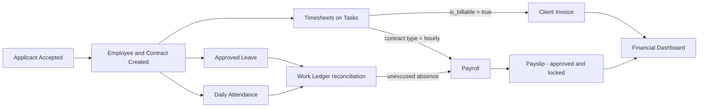

# Mada ERP — Project Vision

> Part of the Mada ERP documentation set. See `MADA_DOCS.md` for the full Software Design Document. This file must not be read in isolation when making architectural decisions — cross-check `ARCHITECTURE.md` and `MODULES.md`.

## 1. What Mada ERP Is

Mada ERP is a **commercial, multi-tenant SaaS application** — not a prototype, not an internal tool, not a graduation project. It is built to be sold to real companies, operated at scale, and maintained over years. Every decision in this documentation set is made with that bar in mind: production security, data isolation, auditability, and maintainability come first.

Mada ERP integrates three business domains that are normally sold as separate tools:

1. **HR & Recruitment** — hiring, employee records, attendance, leave.
2. **Operations & Projects** — task/project execution, time tracking.
3. **Finance & Payroll** — payroll, invoicing, expenses, financial reporting.

Each tenant (a customer company) operates in complete data isolation from every other tenant, under a single shared application and database, managed centrally by Mada's own Super Admin layer.

## 2. The Value Proposition: The Canonical Closed-Loop Data Flow

Mada's core differentiator is not "more modules than the competition" — it is that **the modules are structurally connected**, so data entered once flows automatically to every place it's needed, with zero manual re-entry:

In plain terms: **recruit → employ → track work → get paid, generate client revenue, and see it all on one financial dashboard.** Competing point-solutions (an ATS, a project tool, a payroll tool) require this data to be manually reconciled between systems. Mada's entire architecture exists to make that reconciliation automatic and provably correct (see `ARCHITECTURE.md` §"Work Ledger" and `MODULES.md` for the reconciliation rules that make this safe rather than just convenient).

## 3. Target Customer

SMB and mid-market organizations (roughly 5–500 employees) that currently either:
- Use 3+ disconnected tools (e.g., a spreadsheet for HR, a separate PM tool, a separate payroll process), or
- Have outgrown spreadsheets but find full enterprise ERPs (Odoo, SAP) too complex/expensive to implement.

Primary market: MENA region (hence Arabic-first bilingual support — see `DESIGN_SYSTEM.md`), expandable to any English/Arabic-speaking market.

## 4. Explicit Non-Goals (v1 and near-term)

These are deliberate exclusions, not oversights. Do not build toward these without first amending this document:

| Non-goal | Reasoning |
|---|---|
| Full accounting/GL (chart of accounts, double-entry bookkeeping) | Mada's Finance module produces payroll and client invoices, not a full general ledger. Tenants needing full accounting should export to a dedicated accounting tool. |
| Inventory / manufacturing / supply chain | Out of scope for a services/knowledge-work-oriented ERP. |
| Multi-currency consolidation across tenants | Each tenant operates in a single configured currency (Phase 1–4). Cross-currency consolidation is a post-Phase-4 evaluation, not a commitment. |
| Native mobile apps | Web-first, responsive, mobile-browser-friendly. Native apps are not planned in the current roadmap. |
| Per-tenant dedicated databases | v1 uses shared-schema row-level tenancy (`tenant_id`). Dedicated DBs per large tenant are an architecturally-possible future evolution, not a current commitment (see `ARCHITECTURE.md` ADR-02). |

## 5. Success Criteria for the Product Vision

- A tenant can complete the full closed loop (hire → work → pay/invoice) without ever manually copying data between modules.
- No tenant can ever see another tenant's data, under any code path, including background jobs and caching.
- A regular employee's daily experience (Check-In/Check-Out, view/filter own tasks) is fast and requires no training — see `MODULES.md` BR-701 and `USER_JOURNEYS.md`.
- The platform looks and feels like a serious commercial product: consistent branding, dark/light mode, RTL/LTR correctness, no default framework error pages exposed to users.
