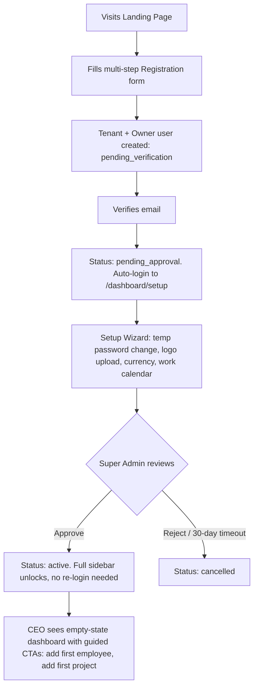
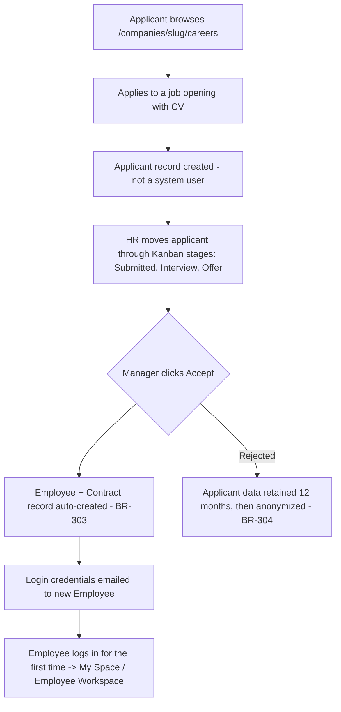
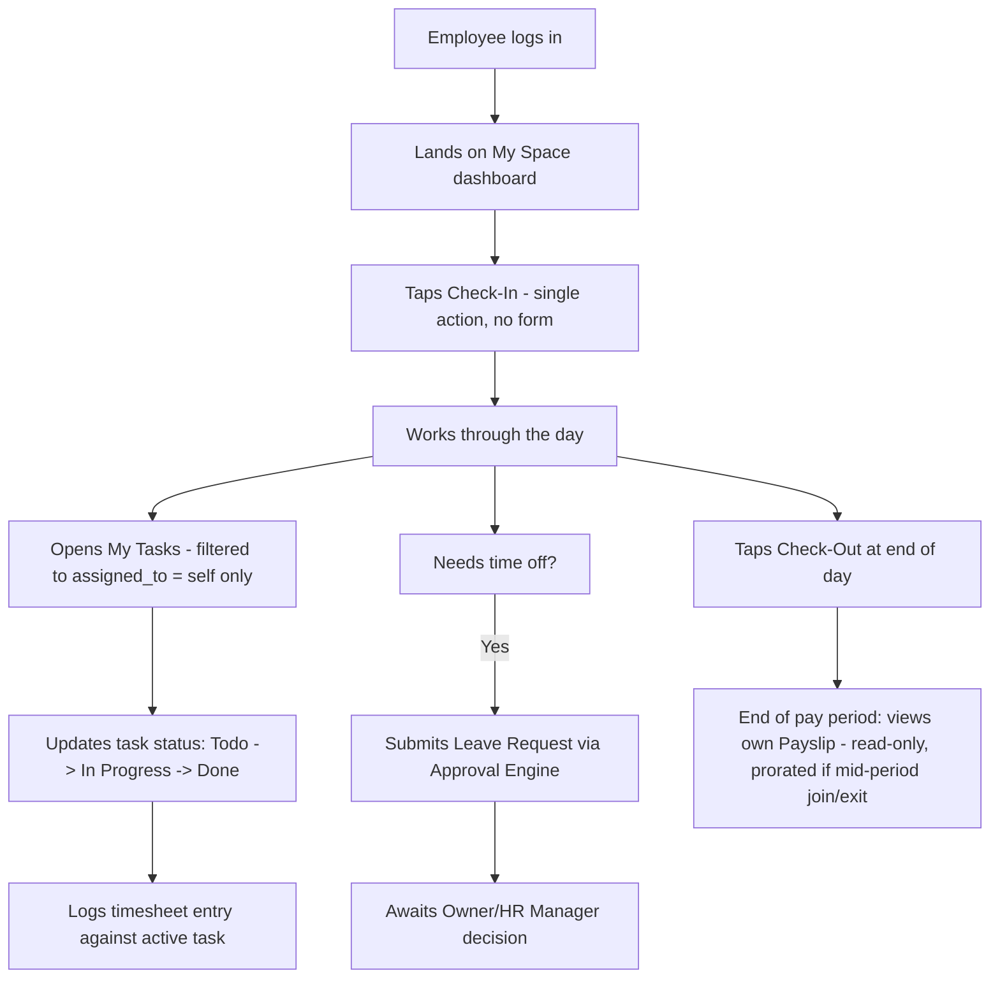
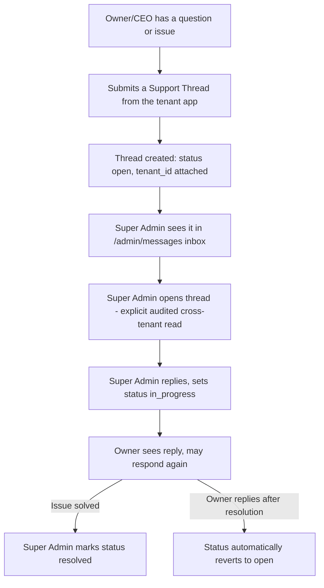

# Mada ERP — User Journeys

> Part of the Mada ERP documentation set. See `MADA_DOCS.md` for the full SDD, `ARCHITECTURE.md` for the tenant lifecycle state machine, and `MODULES.md` for BR-701 (Employee Workspace).

## 1. Admin Onboarding Flow (Tenant Signup → Active)

**Actor:** prospective CEO/Owner.

**Governing rules:** BR-201–BR-206 (`ARCHITECTURE.md` §3). Key constraint: no operational route (HR/Projects/Finance) is reachable before step H; the setup wizard sidebar is fully locked during steps E–G.

---

## 2. Applicant-to-Employee Lifecycle

**Actors:** external Applicant, HR Manager/Owner.

**Governing rules:** BR-301–BR-304 (`MODULES.md` §1.2). This journey is Phase 3 scope (`DEVELOPMENT_ROADMAP.md`).

---

## 3. Employee Workspace Journey (Daily Use)

**Actor:** a regular Employee, scoped per BR-701 — this is the highest-frequency journey in the product and must be fast and frictionless.

### 3.1 Step-by-step detail

1. **Check-In / Check-Out:** exactly one primary action per state (Check-In when not yet checked in today; Check-Out when checked in). No employee ever sees another employee's attendance UI.
2. **My Tasks:** a single filtered view (by status/project/due date) strictly scoped to the employee's own assignments (BR-701 §5.2). No "switch view" to see teammates' tasks exists for this role.
3. **Timesheets:** logged only against the employee's own assigned tasks; `is_billable` is set by the Project Manager at the task level, not by the employee (BR-502).
4. **Leave Requests:** routed through the generic Approval Engine (ADR-08); on approval, the Work Ledger is updated automatically (BR-401) — the employee never manually reconciles attendance vs. leave.
5. **Payslip viewing:** read-only, print-friendly view of the employee's own locked/approved payslip only (BR-603) — prorated correctly for mid-period joiners/leavers (BR-605). Employees cannot view draft or other employees' payslips under any condition.

**Governing rules:** BR-701 (`MODULES.md` §5), BR-401/BR-402 (Work Ledger reconciliation), BR-603/BR-605 (Payroll), ADR-08 (Approval Engine), ADR-24 (one light canvas on every screen in this journey — see `DESIGN_SYSTEM.md` §2).

---

## 4. Tenant Support Inquiry Journey

**Actors:** tenant Owner/CEO, Super Admin.

**Governing rules:** BR-805/BR-806 (`MODULES.md` §6.2), the cross-tenant access discipline in `ARCHITECTURE.md` §8. Only the `Owner` role may create a thread — no other tenant role has this capability (mirrors BR-103's "Owner, or Super Admin" pattern for tenant-level authority). This journey's tenant-side entry point (a "Contact Support" action) is a small addition to the tenant app shell, not a page in its own right; the Super Admin-side inbox is the substantial page (`/admin/messages`).

---

## 5. Journey Design Principles (binding)

- Every journey above must degrade gracefully to an **empty state** with a guided CTA on first use (e.g., "No tasks assigned yet," "Check in to start your day") — never a blank screen.
- Every journey must render correctly in both Dark and Light mode, and in both RTL (Arabic) and LTR (English) layouts, from first implementation — not retrofitted later (`DESIGN_SYSTEM.md`).
- No journey step for the Employee role may expose a route or action outside the BR-701 boundary; this must be covered by an explicit authorization test per journey.
