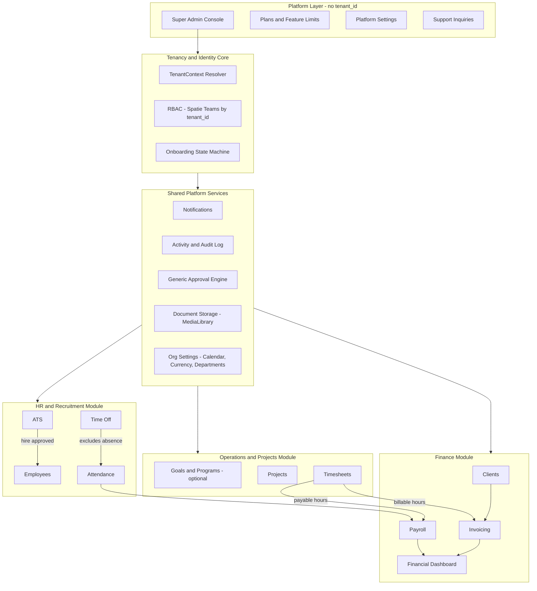
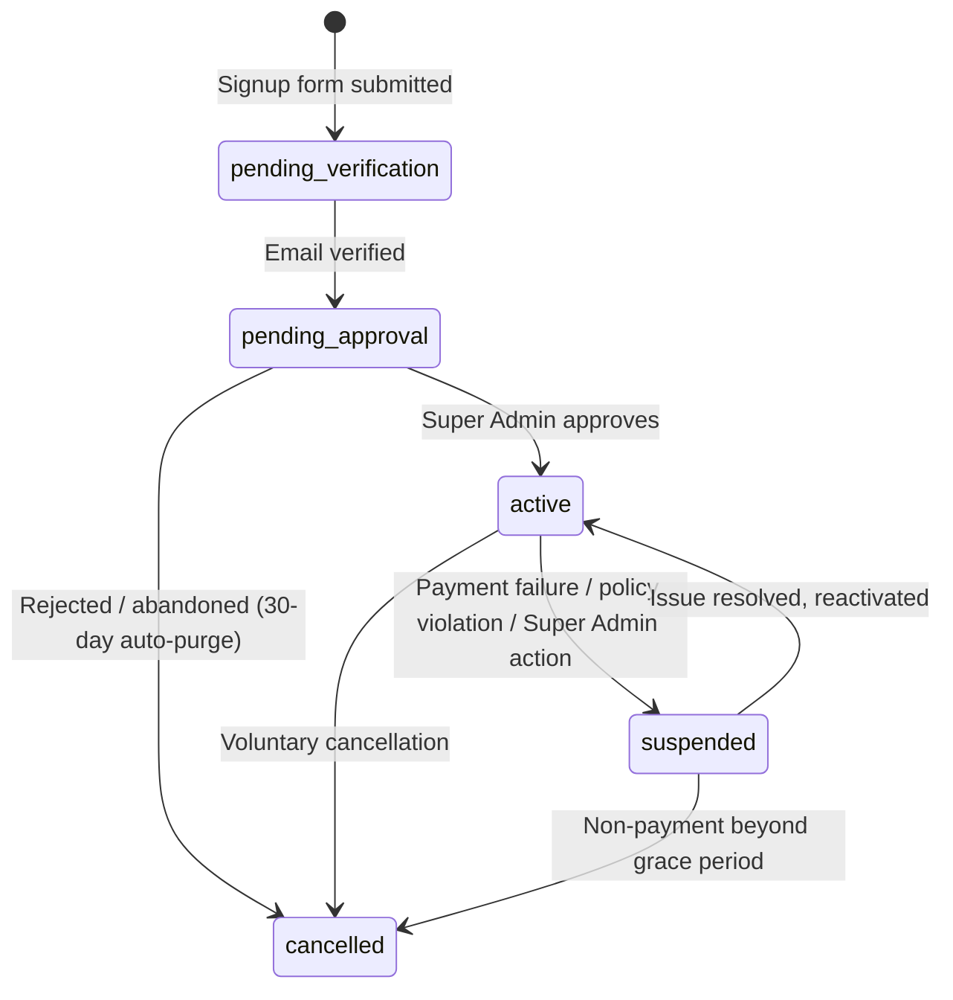

# Veyra ERP — Software Design Document (SDD)

## Document Control

| Field | Value |
|---|---|
| Document | Veyra ERP — Software Design Document (Master Reference) |
| Version | 1.2 (Foundation Architecture + Employee Workspace & Appearance Strategy + Super Admin Platform Console) |
| Status | **Binding — treat as the system's constitution** |
| Owner | Product/Engineering (CTO function) |
| Date | 2026-07-20 |
| Applies to | All engineering, design, and QA work on Veyra ERP, in all future sessions |

**Precedence rule:** This document (and the rest of `docs/`) is the single source of truth. No code, migration, or UI change may contradict a rule defined here. If a new requirement isn't covered, it must be added here first — as a new numbered rule — before being implemented. Every AI session working on this repository must read all files in `docs/` before proposing or making changes.

**Companion documents (all inside `docs/`):**
- `PROJECT_VISION.md` — why Veyra exists, value proposition, non-goals
- `ARCHITECTURE.md` — multi-tenancy, RBAC, tenant lifecycle
- `MODULES.md` — per-module business rules
- `USER_JOURNEYS.md` — critical end-to-end flows
- `DESIGN_SYSTEM.md` — UI/UX, theming, RTL/LTR rules
- `DATABASE_ROADMAP.md` — conceptual schema and data conventions
- `DEVELOPMENT_ROADMAP.md` — phased delivery plan
- `MARKETING.md` — public marketing site sitemap, landing flow, and build plan
- `MARKETING_CMS.md` — marketing CMS database schema, settings JSON groups, and `MarketingContent` cutover plan
- `ADMIN_CMS_ANALYSIS.md` — Super Admin Landing CMS gap analysis, polymorphic images, `custom` disk, admin→DB→Blade flow

This file is the full consolidated reference; the companion files are focused extracts of the same binding rules for quick lookup.

---

## 1. Purpose & Scope

Veyra ERP is a multi-tenant, commercial SaaS platform unifying Recruitment/HR, Project Operations, and Finance/Payroll for SMB and mid-market organizations. It is built as a **real-world commercial product**, not a prototype — every architectural decision below is made with production scale, security, and maintainability as the bar, not classroom simplicity.

**Technology baseline:** Laravel 13, Blade, Livewire 3, Alpine.js, Tailwind CSS, MySQL, Spatie Permission (Teams feature enabled), single-database row-level multi-tenancy (`tenant_id`).

---

## 2. Product Vision

> Veyra ERP is the operating system for growing SMB and mid-market teams — unifying recruitment, HR, project delivery, and financial operations into one tenant-isolated SaaS platform. Veyra's core differentiator is the **closed data loop**: recruit → employ → track work → get paid, generate client revenue, and see it all on one financial dashboard, with zero manual re-entry between modules.

**Non-goals for v1:** full accounting/GL (chart of accounts, double-entry bookkeeping), inventory/manufacturing, multi-currency consolidation, native mobile apps.

Full detail: see `PROJECT_VISION.md`.

---

## 3. Glossary

| Term | Definition |
|---|---|
| Tenant | One customer organization (company) using Veyra. Isolated by `tenant_id`. |
| Super Admin | Platform operator. Not tied to any tenant (`tenant_id = null`). |
| CEO / Owner | The tenant's top-level admin, created at registration. |
| Pending Tenant | A tenant not yet approved by Super Admin; restricted to setup screens only. |
| Applicant | An external, unauthenticated person who applied to a job opening. Not a system user. |
| Employee | A tenant-scoped `User` with an `employee` profile and a `contract`. |
| Billable Hours | Timesheet hours chargeable to a client via an invoice. |
| Payable Hours | Timesheet/attendance hours used to compute an employee's wage. Tracked independently of billable hours. |
| Approval | A generic, polymorphic request awaiting a decision from an authorized role. |
| Work Calendar | Tenant-level configuration of working days, holidays, and timezone. |
| Work Ledger | The reconciled record of workdays vs. attendance vs. approved leave, used as the single source for absence deductions. |
| Platform Setting | A platform-wide (never tenant-scoped) configuration value — branding, SMTP, payment gateway keys, registration auto-approval toggle — managed only by Super Admin. |
| Support Thread | A conversation initiated by a tenant Owner/CEO with Veyra support, handled by Super Admin via the Platform Console; not part of the generic Approval Engine. |

---

## 4. Architecture Decision Records (ADR)

| ID | Decision | Rationale |
|---|---|---|
| **ADR-01** | Frontend stack is **Blade + Livewire 3 + Alpine.js + Tailwind CSS**. | Kanban drag-and-drop, live drawers, wizards, and inline approve/reject actions need server-rendered reactivity without a separate JSON API layer. Livewire ships with Alpine built in. |
| **ADR-02** | Multi-tenancy is **single database, shared schema, row-level `tenant_id`**, enforced via one global scope + one `TenantContext` service bound per request. No per-tenant databases in v1. | Correct lean-SaaS default; abstracted so a future hybrid (dedicated DB for large accounts) is possible without an app-wide rewrite. |
| **ADR-03** | Spatie Permission runs with the **Teams feature enabled, `tenant_id` as the team key.** Roles/permissions are tenant-scoped. | Prevents role name collisions/bleed across tenants. Non-negotiable. |
| **ADR-04** | Tenant status lifecycle is a 5-state machine: `pending_verification → pending_approval → active → suspended → cancelled`. | Represents unverified signups and voluntary cancellation, which a 3-state model cannot. |
| **ADR-05** | Email verification is **required before a tenant record leaves `pending_verification`**, before any dashboard/setup access. | Prevents fake-tenant creation and storage abuse via the setup wizard prior to verification. |
| **ADR-06** | Absence-based payroll deductions come from a **reconciled Work Ledger** = Work Calendar workdays − Attendance − Approved Time Off, never from raw Attendance gaps. | Prevents double-penalizing an employee on approved leave. |
| **ADR-07** | Timesheets carry two independent flags: **`is_billable`** (feeds Invoicing) and the employee's **contract type** (feeds Payroll). Never derived from one another. | A task can be non-billable to a client while still counting toward an hourly employee's pay, and vice versa. |
| **ADR-08** | All approval-driven workflows (Leave, Payroll finalization, Job Offers, Expense claims) run on **one generic, polymorphic Approval engine**. | Eliminates duplicated approval logic; unified audit trail. |
| **ADR-09** | Payroll uses a **maker-checker model**: Finance prepares a run → CEO/Finance Manager approves → run is locked/immutable. No auto-disbursement. | Standard ERP financial control. |
| **ADR-10** | The platform is **bilingual from v1: Arabic (primary) and English**, with Tailwind logical spacing (`ms-`/`me-`) used everywhere so RTL is a first-class layout mode. | Target market (MENA) and Arabic-first business spec make this a day-1 requirement. |
| **ADR-11** | MVP (Phase 1) excludes Payroll, Invoicing, and Recruitment/ATS. Full module list ships across 4 phases. | De-risks the first release; validates tenancy/RBAC and the HR+Projects daily-use loop first. |
| **ADR-12** | Strategic Hierarchy (Goals → Programs) is **optional per tenant**, off by default; Projects → Tasks is the mandatory core model. | Avoids enterprise-OKR setup friction for small tenants. |
| **ADR-13** | File storage (CVs, logos, contracts, payslips) uses `spatie/laravel-medialibrary`, tenant-isolated paths, signed time-limited URLs. | Prevents cross-tenant file access via guessable URLs. |
| **ADR-14** | Super Admin accounts require mandatory 2FA. | Highest-value account on the platform; highest-value target. |
| **ADR-15** | **Appearance Strategy:** the Design System natively supports Dark Mode and Light Mode via Tailwind's class-based `dark:` strategy (not media-query-only), with the user's explicit choice persisted. Every shared component ships with both variants from the moment it is built. | Dark mode is a Phase 1 requirement for every component, not a later retrofit — consistent with building a real commercial product, not a prototype. |
| **ADR-16** | Platform secrets (SMTP credentials, payment gateway keys) stored in `platform_settings` use Laravel encrypted casts and are never re-displayed in plaintext after the initial save — only a "configured / not configured" state is shown. | These are platform-wide, highest-blast-radius secrets; plaintext exposure risk must be closed by design, not by admin-console access control alone. |
| **ADR-17** | Tenant Support Inquiries run on a dedicated `support_threads`/`support_messages` model, **not** the generic Approval Engine (ADR-08). | A support inquiry is an open-ended conversation, not an approve/reject decision — forcing it through the Approval Engine would corrupt that engine's single, clean semantic. |

---

## 5. System Architecture Overview



**Binding architectural principles:**

1. No module reads or writes another module's tables directly — cross-module effects happen through Events/Listeners or explicit service calls.
2. Every tenant-scoped table is queried through the global `tenant_id` scope; controllers/Livewire components never read `tenant_id` off `Auth::user()` ad hoc — always through `TenantContext`.
3. Every queued job explicitly serializes `tenant_id` in its payload and re-binds `TenantContext` on execution.
4. Every financial and HR record is soft-deleted, never hard-deleted.

Full detail: see `ARCHITECTURE.md`.

---

## 6. Identity, Authentication & Authorization

- Single `users` table for Super Admin (`tenant_id = null`), CEO/Owner, and Employees (`tenant_id` set). Applicants are not users.
- Roles/permissions tenant-scoped via Spatie Teams (ADR-03). Default seeded roles per tenant: `Owner`, `HR Manager`, `Finance Manager`, `Project Manager`, `Employee`.
- Only `Owner` (or Super Admin) manages roles/permissions within a tenant.
- Object-level authorization via Laravel Policies layered on Spatie permission checks.
- Super Admin requires mandatory 2FA (ADR-14). Session invalidation forced on role change, suspension, or password change.

### 6.1 Employee Workspace Scope — BR-701

The `Employee` role's UI and backend authorization are restricted to exactly two operational surfaces, enforced via Policy (not hidden menus):

1. **Attendance self-service** — a single-tap Check-In / Check-Out action tied to the current date's attendance record. No visibility into other employees' attendance.
2. **My Tasks** — a task list/board scoped strictly to `assigned_to = current_user`, across all projects they belong to, filterable by status/project/due date, with no create/reassign/delete rights and no visibility into unassigned or other-employees' tasks.

This is a hard authorization boundary. See `MODULES.md` for full detail.

---

## 7. Onboarding & Tenant Lifecycle



Full state rules (BR-201–BR-206): see `ARCHITECTURE.md`.

---

## 8. Module Specifications (summary — full detail in `MODULES.md`)

- **HR & Recruitment:** Departments, Work Calendar, Employees/Contracts (salaried/hourly/volunteer), Attendance, Time Off, Recruitment/ATS (Phase 3).
- **Operations & Projects:** optional Goals/Programs, Projects, Tasks, Timesheets (`is_billable` flag).
- **Finance:** Clients, Payroll (maker-checker, flexible line items), Offboarding/final settlement, Invoicing & Expenses, Financial Dashboard.
- **Platform Services:** generic Approval engine, Notifications, Activity/Audit Log, Document Storage, Org Settings.
- **Super Admin / Platform Console:** Tenant Management & Detail (approve/suspend/reactivate), Plans & Feature Limits, Platform Settings, Notifications Console, Support Inquiries, Super Admin User Management (invite-only operator accounts) — see `MODULES.md` §6.

---

## 9. Information Architecture & Navigation

Navigation is rendered per-role. A plain Employee sees only "My Space" (Check-In/Out, My Tasks, My Time Off, My Payslips) — never admin/manager menu items. Full route index and role-based sidebar tree: see `USER_JOURNEYS.md` and `DESIGN_SYSTEM.md`.

---

## 10. User Roles & Permission Matrix (summary)

| Capability | Super Admin | Owner/CEO | HR Manager | Finance Manager | Project Manager | Employee |
|---|---|---|---|---|---|---|
| Manage tenants/plans | ✅ | — | — | — | — | — |
| Manage Super Admin accounts | ✅ | — | — | — | — | — |
| Manage platform settings | ✅ | — | — | — | — | — |
| Handle support inquiries | ✅ | — | — | — | — | — |
| Submit support inquiries | — | ✅ | — | — | — | — |
| Manage roles/permissions | — | ✅ | — | — | — | — |
| Manage employees/contracts | — | ✅ | ✅ | — | — | — |
| Approve leave | — | ✅ | ✅ | — | — | — |
| Manage recruitment | — | ✅ | ✅ | — | — | — |
| Manage projects/tasks | — | ✅ | — | — | ✅ (own) | — |
| Log timesheets | — | ✅ | — | — | ✅ | ✅ (own tasks) |
| Check-In / Check-Out | — | ✅ | ✅ | ✅ | ✅ | ✅ |
| View/filter own tasks only | — | — | — | — | — | ✅ |
| Prepare/approve payroll | — | ✅ (approve) | — | ✅ (prepare) | — | — |
| View financial dashboard | — | ✅ | — | ✅ | — | — |
| View own payslip/attendance/leave | — | ✅ | ✅ | ✅ | ✅ | ✅ |

---

## 11. Non-Functional Requirements

**Security:** Super Admin 2FA (NFR-01); rate limiting on register/login/careers endpoints (NFR-02); validated, tenant-isolated, signed-URL file storage (NFR-03); custom branded 403/404/500 pages (NFR-04); all permission/role changes and impersonation events audit-logged (NFR-05); platform secrets (SMTP, payment gateway keys) encrypted at rest, never displayed in plaintext post-save (NFR-14, ADR-16).

**Scalability:** `tenant_id`-leading composite indexes on all tenant-scoped tables (NFR-06); tenant-prefixed cache keys (NFR-07); tenant-context-safe queued jobs (NFR-08); tenancy resolver abstracted for future hybrid dedicated-DB model (NFR-09).

**Availability & Integrity:** soft-deletes only for financial/HR records (NFR-10); locked/approved payroll runs immutable (NFR-11).

**Retention:** cancelled tenants retained 90 days then purged (NFR-12); rejected applicant data anonymized after 12 months (NFR-13).

Full detail: see `ARCHITECTURE.md` and `DATABASE_ROADMAP.md`.

---

## 12. Design System (summary — full detail in `DESIGN_SYSTEM.md`)

- Palette: Emerald & Charcoal, consistent across marketing, app, and error pages.
- **Appearance Strategy (ADR-15):** native Dark Mode / Light Mode via Tailwind class-based `dark:` variant, persisted per-user choice, mandatory on every shared component from Phase 1.
- Layout direction: RTL-first with LTR support via Tailwind logical properties (`ms-`, `me-`, etc.) — ADR-10.
- Shared components: `card`, `status-badge`, `kanban-column`, `empty-state`, `slide-over-drawer`, `wizard-stepper`, `payslip/print-view`.

---

## 13. Backend Architecture Conventions

Thin Controllers/Livewire components → Action classes (single business operation) → Models. Cross-module communication via Events/Listeners only. Domain-oriented folder structure:

```
app/
  Domain/
    Tenancy/      Tenant, TenantContext, onboarding actions, middleware
    HR/           Employees, Contracts, Attendance, TimeOff, Recruitment
    Projects/     Goals, Programs, Projects, Tasks, Timesheets
    Finance/      Payroll, Invoicing, Expenses, Clients
    Platform/     Notifications, Approvals, AuditLog, PlanFeatures
  Http/Controllers/   (thin, module subfolders)
  Livewire/           (module subfolders)
resources/views/
  public/  auth/  admin/  app/  components/
```

---

## 14. MVP Scope & Phased Roadmap (summary — full detail in `DEVELOPMENT_ROADMAP.md`)

| Phase | Scope |
|---|---|
| Phase 1 — Core & MVP Operations | Tenancy/Auth/Onboarding, RBAC, Org Settings, Employees/Contracts, Attendance, Time Off, Projects/Tasks/Kanban, Timesheets, Employee Workspace (BR-701), Dark/Light mode (ADR-15), basic Notifications, Activity Log, **Super Admin Platform Console** (Dashboard, Tenant Management/Detail, Plans reference, Platform Settings baseline, Notifications Console, Support Inquiries, Super Admin User Management — `MODULES.md` §6) |
| Phase 2 — Finance & Payroll | Clients, Payroll (maker-checker), Offboarding, Invoicing & Expenses, Financial Dashboard, payment gateway keys in Platform Settings go live |
| Phase 3 — ATS & Recruitment | Public Careers pages, ATS Kanban, CV viewer, auto-employee conversion |
| Phase 4 — Platform Maturity & SaaS Limits | Strategic Hierarchy, feature-gating enforcement (activates the plan-limit-warning Notifications Console category), global search, reports/export, Super Admin impersonation, real-time notifications |

---

## 15. Risks & Mitigations

| Risk | Mitigation |
|---|---|
| Cross-tenant data leak via missed global scope | Single enforced `TenantContext` + global scope; PR review checklist. |
| Payroll calculation error reaches employees | Maker-checker approval; locked runs; adjustment-only corrections. |
| Fake/bot tenant signups | Email verification gate + rate limiting. |
| Role name collisions across tenants | Spatie Teams scoping — must be configured before any role UI is built. |
| Scope creep re-bundling Phase 2/3 into MVP | Phase gates are binding; re-scoping requires updating this document first. |
| Employee gaining access beyond own tasks/attendance | BR-701 enforced via Policy, tested explicitly in QA. |
| Platform secret (SMTP/payment gateway key) leaked via UI or logs | Encrypted-at-rest storage, never re-rendered in plaintext (ADR-16, NFR-14). |
| Support inquiry access becomes an unaudited cross-tenant backdoor | Explicit audited read pattern, identical discipline to Tenant Detail access (`ARCHITECTURE.md` §8, BR-805). |

---

## 16. Open Items for Future Revisions

- Payment gateway selection for tenant subscription billing (Phase 2 dependency).
- Whether the Applicant status-check portal requires magic-link auth or stays fully anonymous — decide before Phase 3.
- Multi-currency support beyond a single tenant-level currency setting — deferred past Phase 4.

---

**Instruction for all future sessions:** Read every file in `docs/` before proposing or making any code, database, or architectural change. Treat these documents as the system's constitution. Never suggest a modification that conflicts with a rule defined here without first raising the conflict explicitly and updating this document.
